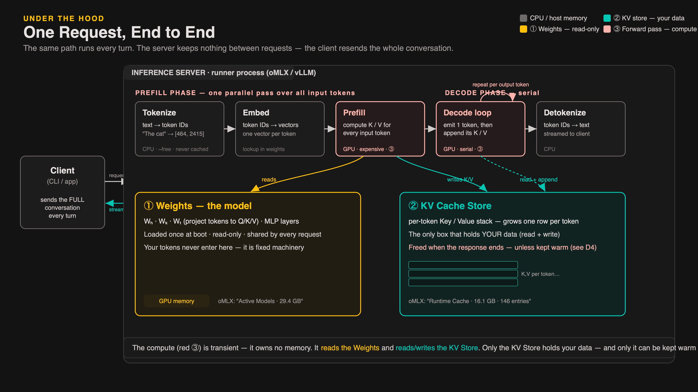

# LLM-কে একটা প্রশ্ন পাঠানোর পর ভেতরে আসলে কী ঘটে

> একটা request server-এ ঢুকে বেরোয় কীভাবে — পাঁচটা বাক্স, দুটো memory store। আর ওই path-এর ভেতরেই লুকিয়ে আপনার LLM bill-এর কয়েক হাজার ডলারের পার্থক্য।

একটা prompt পাঠানো আর উত্তর পাওয়ার মাঝের এক-দুই সেকেন্ডে পাঁচটা বাক্স পার হতে হয়, দুটো memory store ছুঁয়ে যেতে হয়। এই post-এ সেই পুরো path একবারে দেখব — কারণ এই path না বুঝলে LLM-এর cost কেন বাড়ে সেটাও বোঝা যাবে না।

---

## TL;DR

- **Server stateless** — client প্রতি turn-এ পুরো conversation পাঠায়; server দুটো request-এর মাঝে কিছুই মনে রাখে না।
- **Prefill expensive** — প্রতিটা input token-এর জন্য একটা K আর একটা V, এক parallel GPU pass-এ; input যত বড়, খরচ তত বেশি।
- **Weights read-only** — একবার load, সবাই share, আপনার data ওখানে ঢোকে না।
- **KV Cache Store** — একমাত্র বাক্স যেখানে আপনার data থাকে; default-এ response শেষে evict হয়। Prompt caching চালু থাকলে provider এই cache TTL পর্যন্ত ধরে রাখে — পরের request-এ re-compute লাগে না।
- **Decode serial** — একটা একটা করে token; তাই উত্তর আসে word by word।
- এই "মুছে যাওয়া"-র বিপরীতটাই **prompt caching** — আর ওখানেই আপনার bill-এর গল্প।

---

## Server stateless — "conversation" একটা illusion

LLM server stateless। সে দুটো request-এর মাঝে কিছুই মনে রাখে না।

আপনি যখন ৩০ message-এর মাঝে Claude-কে জিজ্ঞেস করেন "আগে যা বললাম মনে আছে?" — সেই "মনে থাকা" server-এ কোথাও বসে নেই। Anthropic-এর server সম্পূর্ণ stateless। প্রতিটা turn-এ Claude Code আপনার machine থেকে **পুরো conversation** পাঠায়: system prompt, tool definitions, আগের প্রতিটা প্রশ্ন আর প্রতিটা উত্তর — সবকিছু, প্রতিবার, প্রথম থেকে।

```
Turn 1:  [system prompt][turn 1]                          → ছোট
Turn 2:  [system prompt][turn 1][turn 2]                  → বড়
Turn 3:  [system prompt][turn 1][turn 2][turn 3]          → আরও বড়
  ...
Turn 30: [system prompt][turn 1][turn 2]...[turn 30]      → বিশাল
```

"Conversation" জিনিসটা client তৈরি করে, replay করে — server-এর দিক থেকে প্রতিটা request একদম নতুন।

এই কথাটা মাথায় না থাকলে LLM-এর cost কেন বাড়তে থাকে সেটা কখনো বোঝা যাবে না।

---

## পাঁচটা বাক্স, দুটো phase

একটা request server-এ ঢোকার পর দুটো phase-এ পাঁচটা বাক্স পার হয়।



---

## Phase 1 — Prefill: সব input token-এর উপর একটা parallel pass

### Tokenize — text থেকে সংখ্যা

Text টুকরো টুকরো হয়ে **token ID** হয়ে যায়।

```
"The cat"  →  [464, 2415]
```

CPU-তে চলে, প্রায় free। গুরুত্বপূর্ণ কথা: **model এখনো ছোঁয়াই লাগেনি।** কোনো neural network নেই, স্রেফ একটা lookup table।

### Embed — সংখ্যা থেকে vector

প্রতিটা token ID একটা করে **vector** হয়ে যায়: one token, one vector। এখানেই model প্রথমবার জড়ায় — vector আসে model-এর weights থেকে। তবু এখনো সস্তা।

### Prefill — GPU · expensive

এই বাক্সই সবচেয়ে দামি।

Model সবগুলো vector *একসাথে*, একটা parallel pass-এ নেয়, আর attention mechanism দিয়ে **প্রতিটা input token-এর জন্য একটা key vector আর একটা value vector** হিসাব করে।

> **⚠️ এই "key-value" Redis-এর key-value না।**
>
> Software-এর মানুষ "KV" শুনলেই dictionary বা cache-store মনে পড়ে — একটা key দিলে একটা value ফেরত আসে। এখানে সেটা নয়। পুরো request-এর জন্য একটা pair না — **প্রতিটা token-এর জন্য** একটা K আর একটা V, row-এর পর row।
>
> Key বলে "আমি কী ধরনের জিনিস"; Value বলে "আমার কাছ থেকে কী information নেওয়ার আছে।" পরে নতুন token generate হলে সে এই key-গুলোর সাথে নিজের query মিলিয়ে ঠিক করে কোন আগের token-এর দিকে কতটা মন দেবে।

দুটো কথা মনে রাখুন:

- GPU-র সবচেয়ে বড় সময় **এই pass-এই পোড়ে**
- খরচ আপনার input-এর size-এর **সমানুপাতিক** — 50K token পাঠালে 50K token-এর prefill, প্রতি turn-এ

---

## দুটো memory বাক্স — engine বনাম cargo

Pipeline-এর নিচে দুটো বড় বাক্স বসে আছে। এরা একেবারেই আলাদা জিনিস।

### ① Weights — the model (read-only)

এটাই model "নিজে" — projection matrix, MLP layer সব। Boot-এর সময় **একবার** load হয়, তারপর **read-only**। প্রতিটা request — প্রতিটা user — একই weights ভাগ করে চালায়।

```
Active Models: 29.4 GB  (oMLX, Mac Mini M4 Pro)
```

**আপনার conversation থেকে weights কিছু শেখে না, কিছু রাখে না, এক bit-ও বদলায় না।** Model আপনার কথা "মনে রাখছে" না — weights হলো engine, cargo না।

### ② KV Cache Store — আপনার data

Prefill যে K আর V বানাল সেগুলো এখানে জমে — token প্রতি এক row করে বাড়ে।

```
Runtime Cache: 16.1 GB  (এই মুহূর্তে)
```

এটাই **একমাত্র বাক্স যেখানে আপনার data থাকে** — read আর write দুটোই এখানে। Default-এ response শেষ হলে এই cache evict হয়। Prompt caching চালু থাকলে provider stable prefix-এর K/V এই একই store-এ TTL পর্যন্ত ধরে রাখে — পরের request-এ সেই অংশ আর re-compute করতে হয় না।

দুটো বাক্সই বসে একই দ্রুত GPU memory-তে। এজন্যই Apple-এর unified memory নিয়ে এত আলোচনা, এজন্যই Nvidia-র GPU-তে এত বিশাল high-bandwidth memory — প্রতিটা token বানাতে chip-কে weights *প্লাস* এই বাড়তে থাকা cache — দশ-বিশ gigabyte — পড়ে ফেলতে হয়।

**LLM inference আসলে যতটা না হিসাবের খেলা, তার চেয়ে বেশি memory bandwidth-এর খেলা।**

---

## Phase 2 — Decode: একটা একটা করে token

Prefill শেষে output শুরু হয়। Decode **serial** — একটা একটা করে token।

Loop-টা এরকম:

```
1. model একটা token বের করে
2. সেই token-এর K আর V → KV Cache Store-এ append
3. পরের token ঠিক করতে model পেছনে যায় না —
   cache-এ জমা K/V পড়ে (input + এ পর্যন্ত সব generated token)
4. ফিরে যাও ১-এ
```

Cache-টা আছেই এই কারণে: **একবার যে token-এর K/V হিসাব হয়ে গেছে, তাকে আর কখনো re-process করতে হয় না।**

এজন্যই:
- Prefill এক গিলায় পুরো prompt খেয়ে ফেলে → **parallel**
- উত্তর আসে word by word → **serial**

শেষ বাক্স — **Detokenize** — আবার CPU-তে। Token ID আবার text হয়ে, যেমন যেমন তৈরি হচ্ছে, stream হতে থাকে। আপনার screen-এ উত্তর word by word ফোটার কারণ এটাই।

---

## সবচেয়ে দামি সত্যিটা

Compute transient — তার নিজের কোনো memory নেই। সে শুধু weights পড়ে আর KV store-এ পড়ে-লেখে।

**Response শেষ হলেই KV store মুছে ফেলা হয়।**

পরের turn-এ client আবার পুরো conversation পাঠাবে, server আবার *শূন্য থেকে* পুরোটা prefill করবে — যদিও context-এর সামনের অংশটা (system prompt, tools, আগের turn-গুলো) একটুও বদলায়নি।

*Unless* — কেউ সেই cache warm রাখে।

এই "unless"-টাই **prompt caching**। Provider যখন stable prefix-এর KV cache ধরে রাখে, পরের request-এ সেই অংশটা আর re-compute করতে হয় না — সোজা cache থেকে পড়ে নিলেই হয়।

Anthropic-এর published API rate অনুযায়ী:

- **Normal input** — ১×
- **Cache write** — ১.২৫×
- **Cache read** — ০.১০×

Cache write-এর ওই ০.২৫× বাড়তি খরচ প্রথম read-েই উঠে আসে — তারপর থেকে প্রতিটা read সরাসরি savings।

একটা ৫০-turn session-এ system prompt আর early turn-গুলো ৫০ বার re-read হয়। Cache ছাড়া সেটা ৫০× input cost। Cache-সহ: ১.২৫× (প্রথমবার write) + ৪৯ × ০.১× (read) = ৬.১৫×। **৮৮% কম।**

ওই এক "unless"-এর মধ্যে কয়েক হাজার ডলারের পার্থক্য লুকিয়ে আছে।

---

*এই post-টা আমার "Agentic Software Engineering" course-এর "Under the Hood" module-এর উপর ভিত্তি করে লেখা — সেখানে এই map-এর প্রতিটা বাক্স ধরে ধরে আরও গভীরে গেছি: attention-এর হিসাব, prefill বনাম decode-এর live benchmark, আর cache warm রাখার অর্থনীতি।*
