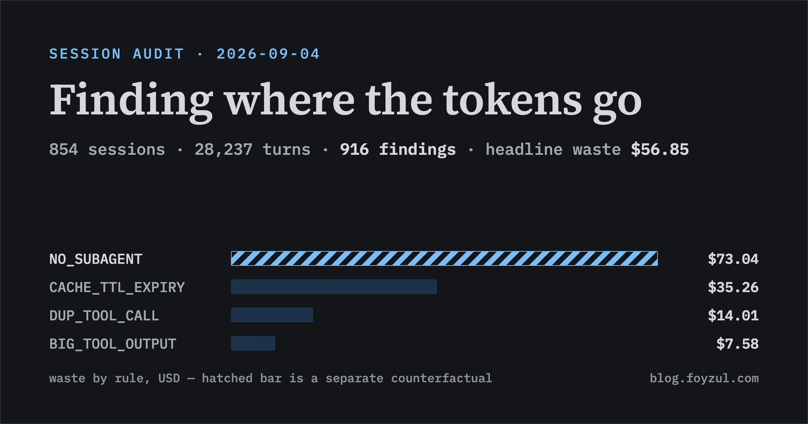

← [Back to the curated DOs and DON'Ts](/agentic-session-efficiency-dos-and-donts/)



- `projectsDir`: `/Users/foyzul/.claude/projects`
- sessions audited: **854** (9 active excluded)
- date window: 2026-07-12 → 2026-09-04

## Headline

854 sessions · 28,237 turns · cacheRead 3989.1M · cacheCreation 47.9M · hit ratio **0.988**

**findings: 916 · headline waste 25,869K tokens ≈ $56.85**

NO_SUBAGENT carries a separate counterfactual of 44,256K ≈ $73.04 — it is **not** summed into the headline (different counterfactual: delegate-the-phase rather than read-less).

Unpriced-model share: 17.2% (8 local/cheap models — MiniMax-M2.7, MiniMax-M3, Ornith-1.0-9B-4bit, Ornith-1.0-9B-oQ4-fp16, Ornith-1.5-9B, Ornith-1.5-9B-MLX-4bit, Qwen3.8-27B-OptiQ-4bit, gpt-oss-20b-MXFP4-Q8). 82.8% of waste carries a price. **Dollar and token totals are a floor**: thinking tokens and compaction events are not measured by any rule.

## Findings by rule (headline)

| rule              | findings | sessions | waste tokens | $USD  | severity             |
|-------------------|---------:|---------:|-------------:|------:|----------------------|
| CACHE_TTL_EXPIRY  |       54 |       36 |     11,409K | $35.26 | 2 low / 52 medium    |
| DUP_TOOL_CALL     |      652 |      156 |      9,178K | $14.01 | 152 high / 500 medium |
| BIG_TOOL_OUTPUT   |       71 |       66 |      5,279K |  $7.58 | 71 medium             |
| RETRY_STORM       |        3 |        3 |          2K | \<$0.01 | 3 high               |
| CONTEXT_GROWTH    |       95 |       95 |          0K |   $0   | 66 high / 29 medium  *(amplifier — zero direct cost)* |

```
NO_SUBAGENT       ██████████████████████████████████████████████████  41 findings / 41 sess / $73.04  (separate counterfactual)
CACHE_TTL_EXPIRY  █████████████████████████                           54 findings / 36 sess / $35.26
DUP_TOOL_CALL     ████████████                                       652 findings / 156 sess / $14.01
BIG_TOOL_OUTPUT   ██████                                             71 findings / 66 sess /  $7.58
```

(bar widths scaled to NO_SUBAGENT, the largest rule — CACHE_TTL_EXPIRY's bar shows its share of the **headline** ratio, not the absolute.)

### Cache-hit ratio distribution

```
>=0.95         ██████████████████████████████████████████████████  155 sess  (healthy)
0.50-0.90      ██████████████████████████████                       96 sess  (warning)
0.90-0.95      ██████████████████                                  55 sess
<0.50          ████                                                16 sess
```

532 sessions have no cache and are excluded from the histogram (local/free models that bypass caching). Six of the costliest low-ratio sessions are **NOT** flagged by `CACHE_MISS_RATE` because they exceed the entry threshold; they are listed in the worst-sessions table below.

### Projects by waste (dollars)

```
personal-claude-lens              ██████████████████████████████████████████████████  212 sess / $16.17
personal-fine-tuning              ██████████████████████████                         28 sess /  $8.20
personal-aswe-lms                 ████████████████████████                          130 sess /  $7.76
personal-agentic-vod              ██████████████                                    91 sess /  $4.46
al-claude-lens--worktrees-36      █████████                                          4 sess /  $2.92
al-claude-lens--worktrees-41      ████████                                           6 sess /  $2.73
al-claude-lens--worktrees-37      ████████                                           6 sess /  $2.48
al-claude-lens--worktrees-35      ████                                               5 sess /  $1.36
```

`personal-fine-tuning` ranks 3rd by tokens (1,868K) but 2nd by dollars ($8.20) — a 3-5× per-token premium from Opus. The dollar order is the order to act on; the worktree projects share a single codebase but are ranked separately because each worktree path is its own session namespace.

### Worst sessions by waste

| sessionId | project | date | turns | peak | sub | waste | $USD | rule mix |
|---|---|---|---:|---:|:---:|---:|---:|---|
| 4a5aac31-3f1c-4762-8896-a8be5693bd1c | personal-claude-lens | 2026-07-27 | 294 | 602K | Y | 2849K | $5.70 | DUP×9, TTL×4, BIG×1, CTX×1 |
| e245fe56-bc55-461b-9c63-6c9efe7d6c62 | al-claude-lens--worktrees-36 | 2026-07-18 | 564 | 662K | Y | 1307K | $2.61 | BIG×2, DUP×23, CTX×1 |
| c0c38347-5fe4-43b8-aa68-22dd09ce77c1 | personal-aswe-lms | 2026-08-18 | 554 | 770K | n | 1277K | $2.60 | TTL×2, NO_SUB×1, DUP×21, CTX×1 |
| 449adc51-bff4-4b1f-9092-753a7dd1c328 | personal-fine-tuning | 2026-08-20 | 146 | 203K | n | 1256K | $6.28 | TTL×8, CTX×1 |
| 3ae6d031-d88a-4c98-a490-39109c50d261 | al-claude-lens--worktrees-41 | 2026-07-18 | 367 | 473K | n | 1182K | $2.36 | NO_SUB×1, DUP×15, TTL×1, CTX×1 |
| a52bf19a-3e45-4b19-a37b-82fb1200850b | al-claude-lens--worktrees-37 | 2026-07-18 | 586 | 553K | n | 1081K | $2.16 | NO_SUB×1, BIG×1, DUP×21, CTX×1 |
| 5078672b-dc97-4036-b936-80c52a4a42a2 | al-claude-lens--worktrees-35 | 2026-07-20 | 326 | 244K | Y |  980K | $0 | DUP×10, BIG×2, CTX×1 *(unpriced model)* |
| b7f43ac2-c2a1-44fc-a2ef-064a16f36e49 | personal-agentic-vod | 2026-08-08 | 198 | 404K | n |  916K | $1.83 | NO_SUB×1, TTL×1, DUP×21, BIG×1, CTX×1 |

`429adc51` (personal-fine-tuning) is the worst by dollar-per-token ratio at $5.00 per K tokens — about 5× the directory average — driven by 8 user_idle TTL gaps in a single 146-turn session where the user paused to read and ask follow-ups.

### Idle-gap cost curve (raw cache-creation tokens)

| gap | turns | cc/turn | ratio vs baseline | excess (raw) |
|---|---:|---:|---:|---:|
| \< 1 min | 26,587 |    992 |   1.0× |       — |
| 1–5 min |  1,000 |  3,218 |   3.2× |  2,226K |
| 5–30 min |   251 | 14,963 |  15.1× |  3,507K |
| > 30 min |    74 | 93,353 |  94.1× |  6,835K |

Total raw excess 12,567K = **14,453K cost-equivalent** (compared with CACHE_TTL_EXPIRY waste of 11,409K — the gap curve and the rule corroborate each other). 52 of 54 TTL findings carry `gapKind: user_idle` (96%); only 2 are tool_runtime (priced at zero by design).

### Trend by date

```
2026-07-12→08-08  ██████████████████████████████████████████████████  231 sess / 19,118K waste / 0.70% rate
2026-08-09→09-04  ██████████████████                                94 sess /  6,751K waste / 0.55% rate
```

The window is split at the median session date. Waste rate dropped from 0.70% to 0.55% — a ~21% relative improvement, but most of that drop is the smaller read volume in the later window (1,238M vs 2,750M). Token-wise the per-turn rate is roughly steady.

## Ranked fixes

### #1 · TTL expiry after user_idle gaps — $35.26 / 11,409K (62% of headline)

- **Evidence**: 52 of 54 TTL findings are `user_idle`; idle >30m shows a 94.1× amplification in cache-creation per turn. Worst single session: `449adc51-bff4-4b1f-9092-753a7dd1c328` (personal-fine-tuning, $6.28) has 8 user_idle gaps — three of them >1 hour — in one 146-turn fine-tuning adapter session. User said "I actually have almost zero idea about how to create a fine tune adapter, let alone the other keywords. if possible, prepare your own recommendations options and use them" — they paused to read between each prompt.
- **Inspect**: `node {base_directory}/bin/audit.js fetch 449adc51-bff4-4b1f-9092-753a7dd1c328 --kind user_text --limit 5 --max-bytes 500`
- **Cost**: $35.26 / 11,409K tokens (62% of headline waste, 100% of which is user_idle).
- **Attribution**: **habit** — running Claude for long stretches across multiple thinking pauses without `/clear`.
- **Target**: by the next audit, `CACHE_TTL_EXPIRY` should drop under **$15** / 5,000K (the gap rule fires on >5min idle, but the curve shows the >30m bucket alone is 6,835K raw).

### #2 · DUP_TOOL_CALL on Read — $11.66 / 7,660K (21% of headline)

- **Evidence**: Read alone accounts for 295 of 652 DUP findings and 7,660K of 9,178K wasted tokens. Worst single session: `8e689d85-7c4e-4a8e-ab83-b7888a02355f` re-reads the **same 483K bytes 11 times** in one session (592K waste). `4a5aac31-3f1c-4762-8896-a8be5693bd1c` (personal-claude-lens, $5.70) reads the same 100K file 4× and the same 73K file 7× — total 1,290K of waste from re-reads in one session, while the user asked it to "invoke dev-pipeline:review skill" and then "resume all subagents".
- **Inspect**: `node {base_directory}/bin/audit.js fetch 4a5aac31-3f1c-4762-8896-a8be5693bd1c --kind user_text --limit 3 --max-bytes 500`
- **Cost**: $11.66 / 7,660K (21% of headline).
- **Attribution**: **habit** — context_growth compounds and the agent re-Reads files it already saw rather than trusting its context.
- **Target**: by the next audit, DUP waste should fall under **$7** / 4,500K; the `8e689d85` outlier (11× same 483K read) should not recur.

### #3 · NO_SUBAGENT in marathon sessions — 44,256K / $73.04 (separate counterfactual, 1.3× headline)

- **Evidence**: 41 sessions over 73 with NO_SUBAGENT findings. Top: `7302d6bc-c494-4023-be03-a443fb6acf77` did 93 scan calls / 468K bytes inline (6,074K waste). Sessions >100 turns with no subagent: **55 of 81 (68%)**. Top NO_SUBAGENT sessions overlap the top CONTEXT_GROWTH peaks (`7302d6bc`, `a52bf19a`, `3ae6d031`, `4a5aac31`) — the agent absorbs all the scan work into its main loop, which compounds with TTL and DUP waste.
- **Inspect**: `node {base_directory}/bin/audit.js fetch 7302d6bc-c494-4023-be03-a443fb6acf77 --kind user_text --limit 3 --max-bytes 500`
- **Cost**: 44,256K / $73.04 — **equal in magnitude to the entire rest of the headline combined**. This is NOT summed into the headline per spec.
- **Attribution**: **skill_file** — `dev-pipeline:plan-architecture` should mandate subagent delegation in Phase 1 when scope exceeds a threshold.
- **Target**: by the next audit, the share of sessions >100 turns with NO_SUBAGENT should fall under **50%** (currently 68%).

### #4 · BIG_TOOL_OUTPUT on Read — $7.58 / 5,279K (13% of headline)

- **Evidence**: 69 of 71 BIG findings are Read; sample `d4a968ab` Read 38,629 bytes for a 8,629-byte excess over the 30KB threshold. Read is the largest tool by bytes-into-context (18.47MB across 3,467 calls).
- **Cost**: $7.58 / 5,279K (13% of headline).
- **Attribution**: **skill_file** — `dev-pipeline:implement` should recommend offset/limit Reads for files >500 lines.
- **Target**: by the next audit, BIG waste should fall under **$3** / 2,000K; the threshold should move from 30KB to 20KB once this is achieved.

### #5 · Opus per-token premium on personal-fine-tuning — $8.20 from 28 sessions

- **Evidence**: personal-fine-tuning ranks 3rd by tokens (1,868K) but 2nd by dollars ($8.20) — Opus prices each token at 3-5× directory average. Worst session `449adc51` (above) is at $5.00 per K tokens.
- **Cost**: $8.20 — 14% of headline by dollars, only 7% by tokens.
- **Attribution**: **config** — model default for fine-tuning and routine implementation tasks should be Sonnet; switch up only for the architecture parts.
- **Target**: by the next audit, the per-K price for personal-fine-tuning should drop to ~$2.50 (Sonnet-equivalent), reducing project waste to ~$4.

### #6 · personal-claude-lens concentration — 7,183K / $16.17 (28% of headline)

- **Evidence**: 212 sessions / 6,060 turns / 7,183K waste; hosts the longest sessions in the directory (294 turns in `4a5aac31`, 698 turns in `7302d6bc`). These overlap with NO_SUBAGENT (#3) and TTL (#1) — fixing #1 and #3 cuts this project's waste substantially.
- **Cost**: $16.17 — 28% of headline.
- **Attribution**: **habit** — long single-session runs that should have used `dev-pipeline:start-task` to spawn a feature branch with its own conversation.
- **Target**: by the next audit, personal-claude-lens should fall under **$10** ($16.17 → $10).

## Do this first

`#3 NO_SUBAGENT` is the highest-leverage single fix by sheer magnitude ($73.04 — equal to all the rest combined) and is the only one reachable via a **skill_file** edit that keeps paying. The TTL/DUP fixes (#1, #2) require indefinite discipline; the Opus fix (#5) is a config change but its dollar savings depend on whether the model choice is genuinely negotiable.

**Pick**: edit `dev-pipeline:plan-architecture/SKILL.md` to add a Phase-1 rule: *"if the spec mentions ≥5 files or ≥8 distinct tasks, spawn a research subagent before drafting the plan; cite its findings in the plan."* That single rule converts the worst NO_SUBAGENT pattern (93 inline scan calls, 468K bytes, 6,074K waste) into a delegated scan that holds its own context. Cost: one file edit. Permanence: indefinite.

Then `#1 TTL` (CLAUDE.md already documents /clear-after-break; the audit shows it isn't being applied — add a one-line reminder at the top of global CLAUDE.md).

## Trend

**First audit — no baseline yet** (`~/.claude/audit-reports/` was empty before this run). The within-run date split (Jul 12–Aug 8 vs Aug 9–Sep 4) shows waste rate dropping from 0.70% → 0.55%, but the later window is half the volume of the earlier one, so the rate drop is largely a denominator effect. Next audit's headline number is what will tell us if the trend is real.

## Audit self-cost

- `fetch_log.jsonl` (lower bound — escalation fetches only; excludes Phase 1 landscape and own reasoning turns): **6 fetches, ~2,100 bytes**
- 5 `user_text` fetches at `--max-bytes 400` (well under the 2,000-byte per-fetch cap) + 1 narrow aggregate query.

## Stats this report wanted and could not get

- **Skills breakdown by waste contribution**: `views` prints skills by *use count*, not by waste. A skill that is invoked often on a small session is reported alongside one invoked rarely on a marathon session — they look equal. Would need a per-session join from `overview.json` to compute, and I did not do that to keep the report transcript cheap (I8).
- **Per-session subagent savings attribution**: NO_SUBAGENT's $73.04 is a *capacity* counterfactual, not an observed spend. There is no per-session view of how much a delegated scan would have cost; the $73.04 is computed from the bytes the main loop did pull, not from a comparable delegation that ran. Treat as an upper bound on what is recoverable from #3.
