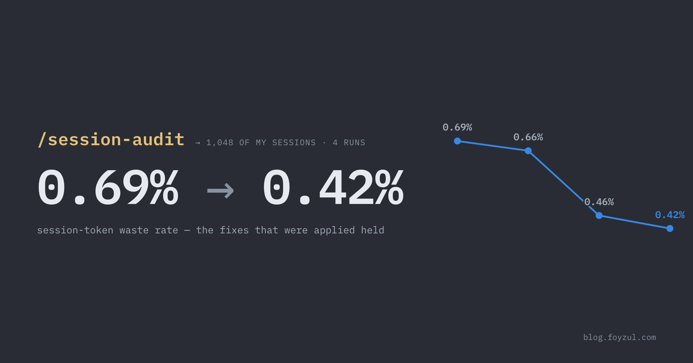
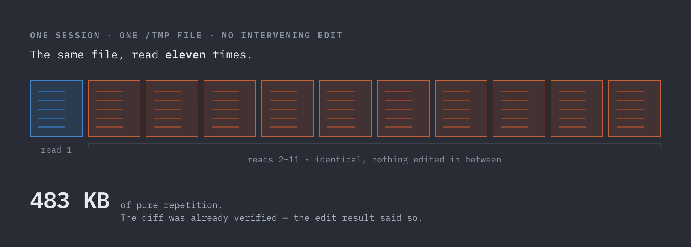

import Figure from '@components/Figure.astro';

  I ran the session-audit skill over my own AI coding sessions — 854 Claude Code sessions, then a
  four-run trend series, then 194 kimi-code sessions — and let it rank where the money was
  going. This is the merged rulebook that came out the other side.

**Tool:** [`session-audit`](https://github.com/foyzulkarim/skills/tree/master/dev-pipeline/skills/session-audit) (https://github.com/foyzulkarim/skills/tree/master/dev-pipeline/skills/session-audit) skill — Audit Claude Code session logs for token waste and produce a ranked, attributed efficiency report (habit / skill_file / config).

<Figure
  scroll
  caption="Waste by category, project, time period, and cache hit ratio — what 854 sessions looked like before the fixes below."
>
  
</Figure>

See the [full audit report →](/agentic-session-efficiency-dos-and-donts/2026-09-04T064534Z/) (854 sessions, 916 findings, ranked fixes).

## The lesson

The principle: **audit your own sessions, apply the fix where it can enforce itself, and re-audit.**

Tokens spent re-doing work the agent already did are pure waste — they consume context and budget
without adding new information. The audits parse session transcripts and produce a ranked report:
waste mechanism, affected
sessions, token and dollar cost, and a concrete fix for each. Across the four-run trend series the
waste rate fell **0.69% → 0.66% → 0.46% → 0.42% of read volume** — but only for the fixes I
actually applied. 

What follows is the curated set I felt most from my own sessions — the rules that moved the trend
line. Everything else from the audits, deduplicated and grouped by theme, lives in **Others**
below. Every number is real, from a named audit run.

## The DOs

### Delegate scanning to subagents

Scan output stays in your main context for the rest of the session. Sessions that never delegated
averaged $73 across the corpus. The worst case ran 93 inline scan calls just to answer "can you
find the editing notes md file in this repository?" — a one-line "find this file" question
that's exactly the kind of task you'd hand off to a subagent, except this session never used one.

- **Dispatch an Explore subagent for any "find X" / "where is Y" question**, and for any scan-heavy
  phase once the inline scan count passes ~15. Subagent bytes never persist in your main context.
  In the 854-session audit, only 6.3% of sessions used a subagent at all.
- **Open marathon sessions with a subagent summary** instead of inlining three large spec docs at
  turn 1. Those docs ride your context prefix for all 284 remaining turns.

<Figure
  scroll
  caption="One “find X” question, answered two ways. Inline, the scan output stays resident in the main context for the rest of the session; delegated, the same 468K is scanned inside the subagent and discarded when it returns."
>
  
</Figure>

### Manage the session lifecycle

The prompt cache has a 5-minute TTL. Cache-TTL expiry alone was 62% of priced headline waste
($35.26); resuming after a >30 min break costs 93× the per-turn cache creation of an unbroken
session.

- **Clear the context (or write a short handoff note) before stepping away.** This fix demonstrably
  worked: TTL findings fell 53 → 38 → 11 → 9 across the four audits.
- **Clear between unrelated work units.** Appending "one more thing" to a long-running session
  inflates every subsequent turn's cost.

<Figure
  scroll
  caption="Turns inside the 5-minute window ride a cached prefix; one long break re-writes the whole thing at cache-write price. Below, the fix landing — cache-TTL findings per audit."
>
  
</Figure>

### Convert your workflow into skills and scripts

Verbal reminders only work while you remember to give them. The same rule written into a skill file
fires on every run, regardless of whether you remember.

- **Bake rules into your skill files and agent config**, which load on every invocation. A one-line
  skill edit makes the rule fire on every run, even when you forget to remind the agent. A verbal
  reminder fades within days.
- **Move a skill's mechanical steps into bundled scripts.** A script runs deterministically at zero
  context cost; the same logic written as prose instructions gets re-read, re-derived, and re-typed
  at full price every single run. Keep the skill file as the thin "when and how to call it" layer.
- **Document the script's usage in the skill file itself.** If the agent has to explore your skill
  to use your skill, you're paying context price for documentation you could have written once.

## The DON'Ts

### Don't re-read files

Tokens spent re-doing work the agent already did are pure waste — they consume context and budget
without adding new information. Re-reading was the single largest such category in every audit:
72% of total waste in kimi-code, ~68% in the trend series, 83% of DUP waste in the big Claude Code
run.

- **Don't re-read a file you already read, with no intervening edit.** The champion: one session
  read the same `/tmp` file eleven times — 483 KB of pure repetition. Trust your edit results; the
  diff was already verified.
- **Don't whole-read spec files when you need one section.** Reads accounted for 97–99.7% of
  oversized-tool-output waste.

<Figure
  scroll
  caption="One session, one /tmp file, no edit between any two reads — ten of the eleven returned bytes that were already in context."
>
  
</Figure>

### Don't fight the session lifecycle

Resuming a big session after a >30 min break re-pays the entire prefix at cache-write prices. Worst
single session: $6.28 in cache-TTL findings alone.

- **Don't resume a session after a >30 minute break.** Start fresh, or hand off with a short note
  instead.
- **Don't paste screenshots one at a time in serial Q&A.** Each image invalidates the cached
  prefix — one 12-turn session hit a 0.34 cache hit ratio where healthy is ~0.98. Batch related
  images into one message.

### Don't rely on discipline alone

A 15-minute, three-file skill edit was recommended four times across audits and never applied,
while remaining ~68% of measured waste.

- **Don't declare a habit "fixed" from a short window.** One report called browser-duplicate waste
  fixed based on 2 sessions; the next audit, with a fuller window, showed 393K of recurrence.
- **Don't ship a script inside a skill without its usage reference** — every session will re-learn
  the tool's own command surface before doing any work.
- **Don't panic about large context peaks.** Prefixes over 200K carried zero direct waste on
  long-context models. Big contexts aren't the bug — they're the *amplifier* that makes the habits
  above expensive.

### Don't misread the data

Audit buckets measure different things — adding them together is a category error.

- **Don't add the no-delegation bucket to the others.** It prices what would have happened with
  delegation; the others price read and duplicate waste. They measure different things.
- **Don't trust a project's aggregate cache hit ratio without per-session waste alongside.** Bad
  cache state shows up in per-session waste first.
- **Don't run the audit on sessions < ~5 turns.** Too short to register meaningful cache state.
- **Don't read trends into a single run.** Wait for archived baselines before calling a rate
  change verified.

## Others

The remaining rules from the audits. Useful context, but not the levers that moved my own trend
line.

### Bound your tool output

Tools return their full output into your context by default. Oversized reads were 13% of headline
waste ($7.58 / 5,279K tokens), with `Read` alone responsible for 97–99.7% of that bucket.

- **Bound `Grep` and `Glob` calls with a head limit.** Most scans only need 20–50 matches; without
  a limit the full result lands in your context window and rides it for the rest of the session.
- **Read with offset and limit on multi-KB files** — especially spec files. Read the section you're
  working on, not the whole document. The worst single finding was a 94 KB read where 64 KB was
  excess.
- **Pipe shell output through `head`, `tail`, or `wc -l`** when the raw output could exceed a few
  KB. `git status`, `git log`, `ls -R`, and `find` are routine offenders.
- **Prefer `Read` over `Bash cat` for known files.**

### Don't scan inline

The biggest savings comes from "delegate the phase," not from "read less." 93 scan calls cost
468K scan bytes for what should have been one subagent dispatch.

- **Don't loop shell + read + grep inline across many targets.** If the scan list gets wide, the
  whole phase belongs to a subagent.

### Measure in dollars, not tokens

The token and dollar rankings disagreed in my data — the biggest waste isn't always the most
expensive waste.

- **Rank waste in dollars, not tokens.** One project wasted 1.6× the tokens of another but cost
  about the same, because it ran at a lower model rate. Fix where the money is.
- **Track per-session waste outliers**, and flag any project crossing ~$0.20/session.
- **Switch models mid-session** for mechanical work — diff paging, test loops, browser verification
  cost 5× on a premium-rate session for the same tokens.
- **Re-audit and track trend lines.** The audit tells you which fixes actually stuck — and which
  recommendations you quietly ignored.

### Don't abuse the tools

Retries burn bandwidth, and click-screenshot-click flows don't compose into skills.

- **Don't retry the same read 3+ times on a path that doesn't resolve.** After two failures,
  re-derive the path. Another identical retry is just logging noise.
- **Don't drive the browser turn-by-turn by hand.** "Click… screenshot… click… screenshot" sessions
  were the worst offenders until the flow was compressed into a skill. If you do a flow twice,
  make it a skill.

### Batch browser automation

Browser QA output (screenshots, page captures) is bandwidth-heavy. 41 duplicate screenshots in one
session cost 547K tokens.

- **Batch browser automation**: 2–3 UI actions per snapshot, one capture per *verified* step, and
  check console and network logs before re-capturing the whole page.

## Know your harness

One caveat before you apply the cache rules universally: they're harness-specific.

Claude Code reports real cache statistics, so cache-TTL expiry is detectable and was its biggest
bucket. kimi-code reports zero cache creation corpus-wide, so the cache rules simply cannot fire
there — don't optimize for cache behavior on a harness that doesn't meter it. Optimize for fewer
total bytes instead: bounded tools, no re-reads, delegation. Those transfer everywhere.

## Close

Most of what the audits caught fits in a skill file — and the skill file wins, because it loads on every run. The rest is small: clear after long breaks, dispatch a subagent when the scan list gets wide, never re-read a file you already have, bound tool output, measure in dollars not tokens. Audit your own sessions, apply the fix where it can enforce itself, and re-audit. The next report tells you which rules stuck and which ones you quietly ignored.

