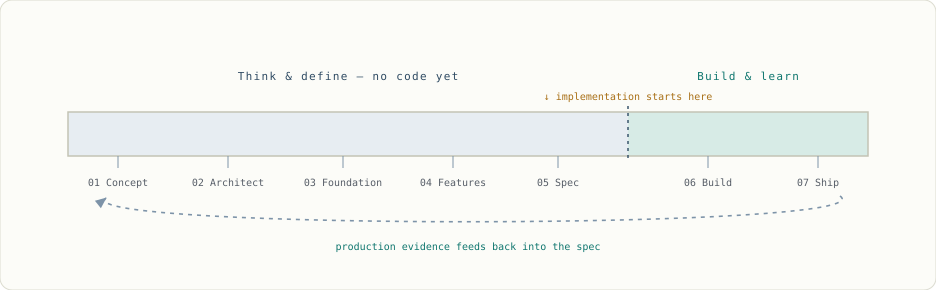
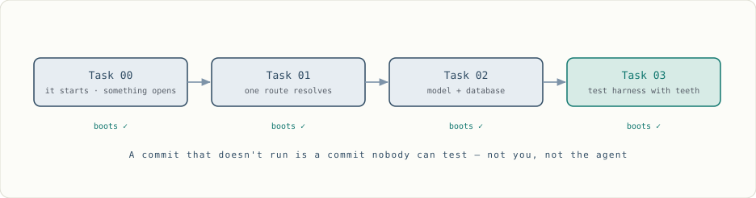
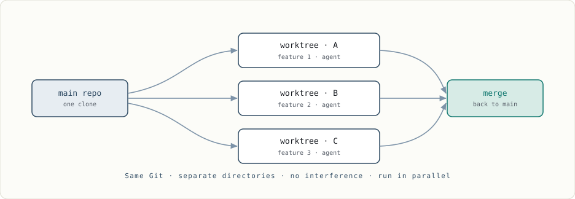
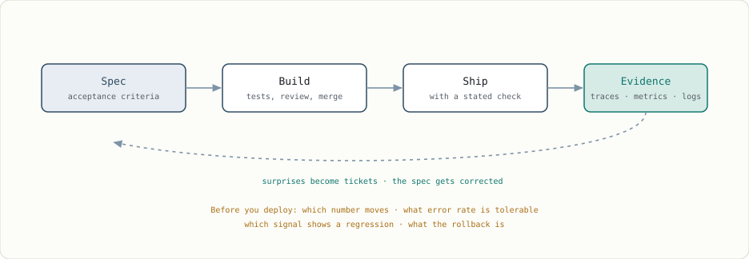

import Figure from '@components/Figure.astro';
import Eyebrow from '@components/Eyebrow.astro';

  Agentic engineering মানে শুধু coding না। Coding এখন সস্তা। আসল value পড়ে আছে একটা line
  লেখার আগে যা যা ঘটে তার মধ্যে — আর ship করার পরে যা যা ঘটে, তার মধ্যেও।

আপনি যদি সত্যিই engineer হিসেবে নিজেকে দাঁড় করাতে চান, তাহলে দেখানো শুরু করুন *AI engineer* হওয়া মানে আসলে কী। বেশিরভাগ company owner নিজেরাই জানে না — mumbo-jumbo requirement আসতেই থাকে — তাই আসল practitioner হওয়াটাই আপনাকে আলাদা করে দেবে। আমি নিজেই তার proof, আর আমার project-টাই real example। ClaudeLens-এর জন্য আমি ঠিক কী করেছি, public-এ কীভাবে বানিয়েছি, আর আপনি কীভাবে একই জিনিস করতে পারেন — পুরোটা এখানে।

এসবের আগে একটা কথা পরিষ্কার করে বলে নেওয়া দরকার, কারণ নিচের পুরোটা আসলে এটারই বিস্তারিত রূপ। এখানে কাজের একটা ভাগাভাগি আছে, আর সেই ভাগটা নড়ে না।

Model option propose করে, code draft করে, tool run করে — আর এসব করে আপনার চেয়ে দ্রুত। আপনি system define করেন, constraint set করেন, risk approve করেন, evidence যাচাই করেন, আর outcome-এর ownership নেন। মাঝখানে বসে থাকে gate গুলো — test, acceptance criteria, review, security policy — আর ওদের একটাই কাজ: বাঁ দিকের column থেকে ডান দিকে যেন check না হয়ে কিছু পার না হয়।

<Figure
  bleed
  scroll
  frame={false}
  caption="এই লেখার সবকিছুই এই ছবিটার নিচে দাঁড়ানো। মাঝের column-টাই সেই জিনিস যেটা বানাতে আপনি সাতটা phase খরচ করবেন।"
>
  
</Figure>

ডান দিকের ওই column-টা লোকে চোখ বুলিয়ে পেরিয়ে যায়, তাই এটা নিয়ে সরাসরি বলি। Agent কিছু ভুল করল আর সেটা production পর্যন্ত পৌঁছাল — incident review-তে model গিয়ে বসবে না। আপনি বসবেন। Stakeholder-এর সামনে আপনাকেই দাঁড়াতে হবে। Authority আর accountability আলাদা হয় না — মানে প্রথমটা হাতে তুলে দিলেও দ্বিতীয়টা পুরোটাই আপনার কাঁধে থেকে যায়।

সাতটা phase। **শেষ দুইটাতে গিয়ে মাত্র code লেখা হয়।**

<Figure
  bleed
  scroll
  frame={false}
  caption="সাতটার মধ্যে পাঁচটা phase-এ কোনো implementation নেই, আর শেষেরটা আবার প্রথমটায় ফিরে আসে। বেশিরভাগ effort — আর বেশিরভাগ learning — খরচ হয় চিন্তা আর define করায়, typing-এ না।"
>
  
</Figure>

<Eyebrow num="Phase 01">Concept</Eyebrow>

## আসল code লেখার আগেই idea-টা HTML-এ দাঁড় করান

পুরনো নিয়মটা ভুলে যান। শুরু করুন Claude বা ChatGPT-র সাথে কথা বলে — *কী* বানাতে চান সেটা নিয়ে। In-depth feature spec না; user experience, product line, feature list, user base।

মাথায় একটা rough mockup দাঁড়িয়ে গেলে চলে যান Claude Design, Lovable, বা Google Stitch-এ। Free credit দিয়েই screen গুলো generate হয়ে যাবে, আর বেরিয়ে আসবে **HTML file** — full React app না, শুধুই HTML। এরপর আমি সেই HTML download করে, আবার agentic tool দিয়েই, প্রতিটা screen-কে equivalent PNG-তে convert করেছি।

PNG কেন? কারণ modern model গুলো *multimodal* — image data টেক্সটের মতো একই input stream-এ ঢোকে, মানে ছবিটা নিজেই একটা valid input, ছবির description না। এর মানে পরে আমি model-কে PNG-টা ধরিয়ে দিয়ে বলতে পারি — যেটা বানিয়েছে সেটা যেটা চেয়েছিলাম তার সাথে মেলে কি না, check করো। নাহলে আমি কীসের ভিত্তিতে বলব output-টা আমার design করা screen-এর সাথে মিলেছে? তিন সপ্তাহ আগের একটা screenshot-এর স্মৃতি দিয়ে?

তাই PNG হলো একটা survey marker। Flat, dated, নড়ে না, আর পরের যেকোনো phase থেকে ওটার দিকে আঙুল তোলা যায়। HTML হলো sketchpad — কাজের, বদলানো যায়, ফেলে দেওয়া যায়। PNG হলো সেই fixed জিনিস, চার নম্বর সপ্তাহে গিয়ে যার সাথে মিলিয়ে দেখবেন। Phase 04-এ একটা script running app-এ click করে করে ঘুরবে আর তার screenshot ঠিক এই file গুলোর সাথে compare করবে — সেই loop-টা বন্ধ হয় শুধু এই কারণেই যে marker-টা আপনি এখানে পুঁতে রেখেছিলেন।

এই phase-এ আরেকটা কাজ আপনি ইচ্ছা করেই করছেন না: **stack pick করছেন না।** HTML regenerate করতে বা ফেলে দিতে কিছুই লাগে না। React app মানেই একটা architectural commitment — আর সেটা নিচ্ছেন ঠিক এমন মুহূর্তে যখন আপনার হাতে সবচেয়ে কম information। দেরিতে choose করলে requirement-এর বিপরীতে দাঁড় করিয়ে choose করবেন। আগে choose করলে বাকি project-টা শুধু নিজের choice-কে rationalise করেই কাটাবেন।

এটাই Phase 1: raw HTML আর CSS দিয়ে যা চান বানান, কোনো coding নেই, PNG export করুন, শেষ। আর পুরোটাই public-এ। আপনি চাকরির জন্য নামছেন, business-এর জন্য না।

<Figure
  bleed
  scroll
  frame={false}
  caption="Design → export → freeze। এই PNG গুলোই সেই reference, পরের প্রতিটা screenshot যার সাথে diff হবে।"
>
  
</Figure>

<Eyebrow num="Phase 02">Architect</Eyebrow>

## দুই ধরনের feature, আর যে তর্ক ঠিক করে দেয় কোনটা কী

এখন আপনার হাতে HTML আর PNG দুটোই আছে। ওগুলো Claude বা Gemini-কে feed করুন — Claude-এর web version-ও চলবে — আর আসল আলোচনাটা শুরু করুন: schema কী হবে, routing কী হবে, কোন foundational feature গুলো আপনার *থাকতেই হবে*? Routing না থাকলে একটা page-এর যাওয়ার কোনো জায়গাই নেই।

তাই শেষে আপনার হাতে দুই set feature থাকবে। এক set হলো **foundational** — must-have। আর অন্যগুলো হলো **feature features** — যে page গুলো এর উপরে বসে।

Technology-র decision আসে *এইখানে*, এর আগে না। আপনি আলোচনা করবেন, debate করবেন, argue করবেন, counter-argue করবেন। ClaudeLens বানাতে গিয়ে আপনি শুরু করবেন data থেকে: Postgres — একটা local, single-user tool যেটা একটা append-only log পড়ছে, তার জন্য এটা কি সত্যিই লাগবে? আর যদি না লাগে, বিকল্পটা কি যথেষ্ট fast? এটা কয়েক round চলেছিল। একদম genuine CS argument, যেটা আপনি whiteboard-এর সামনে একজন senior colleague-এর সাথে করতেন। আর শেষ হয়েছিল এমন জায়গায় যেখান থেকে আমি শুরুই করিনি: general-purpose relational store না, delta-র উপর দাঁড়ানো একটা model।

খেয়াল করুন কী হলো এখানে। যে stack আমি সবচেয়ে ভালো চিনি, সেটাকেই আমি বাদ দিলাম, কারণ এই problem-এর জন্য ওটা ভুল ছিল। "চেনা tool-টা নিয়েছি" আর "ঠিক tool-টা নিয়েছি" — দুটো মিলে গেলে একই repo বের হয়, আর না মিললে সম্পূর্ণ আলাদা দুইজন engineer বের হয়।

### যে জিনিসটা আপনার সাথে একমত হওয়ার জন্যই বানানো, তার সাথে তর্ক করবেন কীভাবে

আপনি architect, তাই শেষ নিঃশ্বাস পর্যন্ত নিজের position defend করুন। কিন্তু সেই লড়াইয়ের অন্য পাশটাকে কীভাবে পড়বেন, সেখানে সাবধান। Model কোনো position ধরে রাখে না — এটা আপনার input-এর সাথে pattern match করে সম্ভাব্য continuation-টা generate করে, আর সেই training data-র সবচেয়ে শক্তিশালী pattern গুলোর একটা হলো একমত হয়ে যাওয়া। যথেষ্ট জোরে ঠেললে যেকোনো কিছুতেই ভাঁজ হয়ে যাবে। আপনি ঠিক হন বা ভুল — ভাঁজ হবেই।

তাই জেতার জন্য তর্ক করবেন না, কারণ জেতাটা আপনাকে কিছুই জানায় না। material পাওয়ার জন্য তর্ক করুন। বলুন Postgres-এর *পক্ষে* সবচেয়ে শক্ত case-টা বানাতে। জিজ্ঞেস করুন কোন workload-এ delta approach ভেঙে পড়ে। জিজ্ঞেস করুন ছয় মাস পরে কোন জিনিসটা নিয়ে আফসোস হবে। Specific উত্তর আপনি গিয়ে verify করতে পারবেন; "আপনি ঠিক বলেছেন" দিয়ে করার কিছু নেই। একমত হওয়াটাকে noise ধরুন, specificity-টাকে signal।

এরপর লিখে রাখুন — আর একটা shape দিন, কারণ chat log-এর ভেতরে চাপা পড়া একটা paragraph কোনো decision না, ওটা একটা mood। পাঁচ লাইনেই হয়ে যায়: context, যে option গুলো দেখেছিলেন, কী choose করলেন, তার খরচ কী, আর কোন জিনিসটা ঘটলে আপনি আবার ভেবে দেখবেন। লোকে এগুলোকে বলে architecture decision record। Repo-তেই রাখুন, যে code-টা explain করছে ঠিক তার পাশে।

শেষ লাইনটাই সবাই skip করে, আর ওটাই সবচেয়ে বেশি কাজে দেয়। "একটা session log 50 MB ছাড়ালে আবার ভেবে দেখব" — এটা এমন tripwire যেটায় আপনি সত্যিই হোঁচট খাবেন। "delta নিয়েছিলাম কারণ ওটা faster মনে হয়েছিল" — এই স্মৃতি অক্টোবরেই মুছে যাবে।

প্রতি decision-এ দশ মিনিট, আর এটাই repo-র একমাত্র artifact যেটা চিন্তার কাজটা না করে কেউ বানাতে পারবে না। আর এটাই আটকায় একটা confident chat reply-কে চুপচাপ permanent architecture হয়ে যাওয়া থেকে।

**এখানে সস্তায় সারবেন না** — syntax লেখাটাই এখন পুরো কাজের সবচেয়ে সস্তা অংশ। Architecture-এ সস্তা করলে output সস্তা হবে, আর আপনি সেই আগের জায়গাতেই ফিরে আসবেন — একগাদা file, কোনো progress নেই।

<Figure
  bleed
  scroll
  frame={false}
  caption="প্রতিটা page foundation-এর উপরে ঝুলে থাকে। একটাও feature বানানোর আগে base-টা ঠিক করুন।"
>
  
</Figure>

<Eyebrow num="Phase 03">Foundation</Eyebrow>

## এমন একটা application যেটা চলে, কিন্তু ভেতরে কিছুই নেই

Foundation মানে একটা বিশাল commit না। আপনি consolidate করবেন — এইগুলো feature, এইগুলো technology — তারপর finalise করবেন, আলোচনা বন্ধ করবেন, আর split করবেন।

Split কীভাবে? একটা rule মানুন, নিজে থেকেই split হয়ে যাবে: **প্রতিটা commit-কে চলতে হবে।** ধরুন আপনি schema দিয়ে শুরু করলেন। Router নেই, backend route নেই, boot হয় এমন project-ও নেই। মানে আপনার হাতে এমন একটা commit যেটা চলেই না। এটা test করবেন কীভাবে? পারবেন না। সম্ভবই না।

তাই উল্টো দিক থেকে সাজান। Task শূন্য: start command দিলেন, কিছু একটা খুলল। এটুকুই পুরো task। Task এক: একটা route resolve হয় — `/matrix`, যেটাই হোক — একটা route, শুরু থেকে শেষ। Task দুই: model আর database, সাথে এমন একটা test যেটা সত্যিই ওগুলোকে খাটায়।

এটাই walking skeleton। কোনো ঘর তৈরি হওয়ার আগেই সিঁড়িঘর আর frame উঠে যায়, আর আপনি পুরো খালি building-এর ভেতর দিয়ে হেঁটে আসতে পারেন।

আর agent-এর যুগে এটা আগের চেয়ে বেশি জরুরি, কারণটা আছে। যে repo boot-ই হয় না, সেটা agent-কে কোনো feedback signal দেয় না। ও generate করে, check করতে পারে না, আর success report করে এই ভিত্তিতে যে success সাধারণত শুনতে কেমন লাগে। তাই foundation আপনাকে প্রথমে code দেয় না — একটা feedback loop দেয়। এটা skip করলে বাকি project-টায় আপনি নিজেই একমাত্র error detector হয়ে বসে থাকবেন।

<Figure
  bleed
  scroll
  frame={false}
  caption="Foundation এমনভাবে সাজান যাতে প্রতিটা commit boot করে। এটাই agent-কে নিজের কাজ যাচাই করার জিনিস দেয়।"
>
  
</Figure>

### Testing-এও সস্তায় সারবেন না

Interview-তে এই জিনিসটাই আপনাকে আলাদা করে দেবে, কারণ feature generate সবাই করতে পারে, কিন্তু "আমি কীভাবে জানলাম এটা ঠিক" — এটা প্রায় কেউ explain করতে পারে না।

যে rule টা আমি আপনাকে দেব: যে failure নিয়ে আপনি সত্যিই চিন্তিত, সেটা ধরতে পারে এমন সবচেয়ে সস্তা test-টা ব্যবহার করুন। Isolated logic-এর জন্য unit test। Boundary-র জন্য integration test — database, filesystem, যা কিছু আপনার নিজের না। আর যে journey গুলো ভেঙে গেলে আপনি লজ্জা পাবেন, সেগুলোর জন্য অল্প কয়েকটা end-to-end test। Pyramid এই কারণে না যে কেউ একটা pyramid এঁকে গেছে। Pyramid এই কারণে যে সস্তা test সস্তা bug ধরে, আর দামি গুলোকে আপনি দামি bug-এর দিকে তাক করে রাখতে চান।

Database-এর জন্য চাই schema-র উপর unit test আর আসল জিনিসের বিপরীতে integration test। Testcontainers দ্বিতীয়টাকে সহনীয় করে তোলে: একটা container তুলুন, migration চালান, insert / delete / update মারুন সেই *test* container-এ — কখনোই আসল staging DB-তে না — তারপর পুরোটা নামিয়ে দিন।

আর in-memory বিকল্পটার লোভ যতই হোক, ওটা বাদ দিন। আপনি যদি schema test করছেন, আর test করছেন এমন engine-এর বিপরীতে যেটা deploy-এ ব্যবহার করবেন না, তাহলে কাজের কিছুই test হয়নি। Type আলাদা। Constraint enforcement আলাদা। Migration আলাদা। JSON column, index semantics, transaction isolation — সব আলাদা। আপনি যে bug গুলো খুঁজছেন সেগুলোর বাস ঠিক ওই দুই engine-এর ফাঁকটাতেই। হ্যাঁ, container ধীর। ওটা নিয়ে মাথা ঘামাবেন না: ওই সময়টা CI খরচ করছে, আপনি না।

এরপর নির্ভর করে আপনি কী বানিয়েছেন তার উপর। আমি Cypress যোগ করেছিলাম। Storybook যোগ করিনি — আপনি করতে পারেন।

Screenshot diffing নিয়ে একটা caveat, যেহেতু আমি এটা বেশ জোর দিয়ে বিক্রি করেছি। আগে behaviour assert করুন; visual comparison যোগ করুন শুধু সেখানে যেখানে চেহারাটা সত্যিই contract-এর অংশ। আর rendering environment প্রতিবার একদম এক রাখুন — অন্য font, অন্য platform, 2px চওড়া একটা scrollbar, আর test fail করা শুরু করবে এমন কারণে যার সাথে আপনার code-এর কোনো সম্পর্কই নেই। Flaky oracle কোনো oracle না থাকার চেয়েও খারাপ, কারণ এক সপ্তাহের মধ্যেই আপনি ওটাকে ignore করা শুরু করবেন।

> Robert C. "Uncle Bob" Martin — clean code আর SOLID-এর দাদা — সম্প্রতি এই ধাঁচের একটা post দিয়েছেন: তিনি আর code পড়েন না। তিনি test আর drill গুলো এমনভাবে বসিয়ে দেন যাতে agent-এর কাছে তিনি যা চান তার বাইরে কিছু produce করার কোনো রাস্তাই না থাকে। তাঁর যুক্তিটাই আমার মাথায় গেঁথে গেছে: syntax পড়তে বসলে তিনি agent-এর output-এর সাথে তাল মেলাতে পারেন না। পড়াটাই bottleneck, তাই তিনি review বাড়ানোর বদলে constraint বাড়ান। উৎসটা কে, সেটা মাথায় রেখে একটু ভেবে দেখুন কথাটা।

আসলে পুরো shift-টাই এটা। Test-কে "code কাজ করছে কি না check করা" হিসেবে ভাবা বন্ধ করুন, আর ভাবতে শুরু করুন **oracle** হিসেবে — এমন জিনিস যেটা কোনো মানুষের diff পড়া ছাড়াই বলে দিতে পারে *এটা ভুল*। Workshop-এর jig আপনার হয়ে কাটে না। ও ভুল কাটাটাকে অসম্ভব করে দেয়।

একবার এভাবে দেখলে বুঝবেন আপনার পুরো pipeline-টাই oracle দিয়ে ভরা। Phase 1-এর PNG গুলো design oracle। Acceptance criteria behavioural oracle। Testcontainers data-layer oracle। Cypress flow oracle। Jig গুলো বানিয়ে ফেলুন, তাহলে প্রতিটা কাটা নিজে গিয়ে পরিদর্শন করতে হবে না।

এই পর্যায়ে এসে foundation হলো **শূন্য feature-ওয়ালা একটা runnable application**। আর খেয়াল করুন: আপনি কিছুই implement করেননি। শুধু task গুলো ঠিক করেছেন।

<Eyebrow num="Phase 04">Features</Eyebrow>

## Screen গুলোকে ticket বানান — এখনো implement না করেই

ClaudeLens-এ এটা ছিল ১২টা page, আগেই define করা। এখন প্রতিটা feature হয় অন্যগুলোর উপর নির্ভর করে, নয়তো একা চলতে পারে — আর architect হিসেবে কোনটা কোনটার উপর নির্ভর করে সেটা আপনিই জানেন। তাই Claude-এর সাথে বসে প্রতিটা feature define করুন title আর ছোট একটা body হিসেবে। ১২টা page থেকে ২০-৩০টা task বেরোবে: dashboard section one, sessions-এর দুইটা section, session page-এর দুইটা, settings, এভাবে।

এরপর sequence করুন। আমি প্রথমবার পড়াতে গিয়ে "orchestrate" বলেছিলাম আর নিজেই শুধরে নিয়েছিলাম, কারণ আসল শব্দটা **choreograph**। Orchestra একসাথে বাজায় একজন conductor-এর নিচে। Choreography-র বিষয় হলো কে কখন নড়বে, কোন ক্রমে, আর পরের move-টা কাজ করার জন্য আগে কী ঘটে থাকতে হবে।

আপনি সেই task গুলো *choreograph* করবেন — কোনটার পরে কোনটা, কোনটার পাশাপাশি কোনটা চলতে পারে। কারণ নয় নম্বর task-এ গিয়ে আপনি আবিষ্কার করবেন foundation ভেঙেছে, বা দুই নম্বর task-এ কিছু একটা বাদ পড়েছিল, আর এখন পুরোটা আবার করতে হবে।

আমি আগে বলতাম, এখানকার skill হলো পুরো জিনিসটা মাথায় ধরে রাখা, শুরু থেকে শেষ পর্যন্ত। এই ব্যাপারে আমি আমার মত বদলেছি। ওটা *সত্যিই* একটা skill আর আপনার সেটা থাকা উচিত। কিন্তু map রাখার জায়গা হিসেবে আপনার মাথাটা ভুল জায়গা: ওটা versioned না, share করা যায় না, আর রাত দুইটায় কোনো agent ওটা পড়তে পারে না। Dependency graph, architecture decision, domain vocabulary আর invariant গুলো repository-তে রাখুন, যাতে আপনি আর আপনার খোলা প্রতিটা session একই file পড়ে। মাথায়ও রাখুন। মাথায় *শুধু* রাখবেন না।

### প্রতিটা feature-কে আসল ticket বানান

একটা feature নিন — এখনো skeleton, detail না। "Claude, চলো dashboard-টা flesh out করি: ওই image-টা পড়ো, component গুলোর নাম বলো, কী কী লাগবে define করো।" এখানেই আমার dev pipeline কাজে আসে — একটা instruction set যেটা step by step চলে। আপনি ওটা দেখবেন, শিখবেন, আর নিজের কাজের ধরন অনুযায়ী tweak করবেন। ওই instruction set-টাই agentic engineering skill। Prompt না — repeatable procedure-টা।

Product manager-রা ticket লিখতে পারে না, এটা কুখ্যাত। এখন আপনি পারবেন। শেষে প্রতিটা ticket চারটা জিনিস বলে দেবে: তার UI output, সাথে আসল image-এর reference; তার route; তার implementation logic; তার acceptance criteria। আরো গভীরে যেতে চান? Playwright তুলে server boot করান, script দিয়ে click করে ঘুরিয়ে আনুন, screenshot নিন — তারপর সেটা Phase 1-এ তোলা screenshot-এর সাথে diff করুন।

আর ticket যাচাই করার যে মানদণ্ডটা আমি ধরব, সেটা পুরনোটা না। পুরনো test ছিল "এই codebase চেনে এমন একজন developer কি এটা বুঝবে?" নতুন test হলো: **শূন্য conversation history-ওয়ালা একটা fresh session কি শুধু এই ticket থেকে ঠিক জিনিসটা produce করতে পারবে?**

এটা কঠিন মানদণ্ড, আর এটাই সঠিক, কারণ execution-এর বাস্তব অবস্থাটা এটাই। Ticket-এ না লিখে chat-এ ফেলে আসা প্রতিটা assumption build-এর সময় একটা coin flip। এমন একজন যোগ্য অপরিচিত মানুষের জন্য লিখুন যার কোনো স্মৃতি নেই — কারণ ঠিক সেই জিনিসটাই এটা পড়তে যাচ্ছে।

<Eyebrow num="Phase 05">Spec &amp; ticketing</Eyebrow>

## Freeze করুন, পুরোটা পড়ুন, তারপর load করুন

প্রতিটা task-এর জন্য এটা repeat করুন, আর তখনো আপনি implement করছেন *না* — চিন্তা আর define করছেন। শেষে হাতে থাকবে acceptance criteria সহ পুরো feature list।

এবার একটা break নিন। একদিন না — কয়েক দিন। তারপর ফিরে এসে পুরোটা ক্রম অনুযায়ী পড়ুন: architecture, foundation, প্রতিটা feature, release পর্যন্ত। একটা document হিসেবে পড়ুন, কারণ যে শ্রেণির error শুধু ticket-এর *মাঝখানে* থাকে, সেটা ধরার এটাই একমাত্র রাস্তা। চার নম্বর ticket আর ঊনিশ নম্বর ticket আলাদা আলাদা ঠিক আছে, আর চুপচাপ একে অপরের সাথে সাংঘর্ষিক। একটা একটা করে ticket review করে এটা পাবেন না। এটা পাবেন তিন সপ্তাহ পরে, code-এর ভেতরে।

ওটাই আপনার spec, আর পুরোটা পড়ে আছে আপনার local repository-তে। কিছুই ship হয়নি।

### Ticketing-টা automate করুন

Implement শুরু করতে চাইলে *কীভাবে* করবেন সেটা ভাবতে হবে — কারণ চল্লিশটা Markdown file আর বিশটা image এক session-এ ঢাললে জিনিসটা ফেটে যাবে। শুধু token limit-এর কারণে না। Window-র ভেতরে থাকলেও instruction গুলো নিজেদের মধ্যে প্রতিযোগিতা করে: এক context-এ চল্লিশটা ticket মানে চল্লিশ set constraint একে অপরকে পাতলা করছে, আর ফেরত আসছে আপনার চাওয়া সবকিছুর একটা average। মানে আপনি যা চেয়েছিলেন তার কিছুই না।

তাই execute করার আগে spec-টাকে ভাগ করতে হবে। আমি GitHub Issues ব্যবহার করেছি। এই step-টা দেখতে bureaucracy-র মতো লাগে, আসলে না — **issue tracker হলো সেই memory যেটা agent-এর নেই।** এক ticket, এক session, এক পরিষ্কার context, যাতে যা দরকার তার সবটুকু আছে আর তার বাইরে কিছু নেই।

Manual-ভাবে, click করে করে? না — scale করুন। একটা script লিখুন, Claude-কে দিয়ে প্রতিটা ticket তুলিয়ে push করান, state update করান, repeat করান, তারপর ঘুমাতে যান। Guard বসান যাতে একই জিনিস দুইবার upload না হয়: একটা state check — draft হলে push করো, done হলে হাত দিও না। Script দশবার চালান, কিছুই duplicate হবে না।

শেষ কথাটা যতটা সাধারণ শোনায় তার চেয়ে বেশি গুরুত্বপূর্ণ। Unattended run মাঝপথে fail করে আপনার নিজের হাতে list ধরে কাজ করার চেয়ে অনেক বেশি, আর আপনি যেটা চান সেটা হলো *resume*, *restart* না। আপনি ঘুমিয়ে থাকা অবস্থায় agent যা চালাবে, তার প্রতিটা জিনিস আবার শুরু থেকে চালানোর মতো safe হতে হবে। Learning-টা এখানেই, আর এটা আপনার লেখা পরের প্রতিটা script-এ কাজে লাগবে।

<Eyebrow num="Phase 06">Build</Eyebrow>

## এখন — আর শুধু এখনই — implementation loop

Foundation থেকে release পর্যন্ত sequence করা একগাদা issue আপনার হাতে, UI সহ সবকিছু নিয়ে। *এবার* building শুরু। প্রথম feature-টা নিন, হাতে তুলে দিন, আর বলুন কাজ শুরু করার আগে ও কী করতে যাচ্ছে সেটা বলে দিতে আর যা কিছু অস্পষ্ট সেগুলো তুলে ধরতে। এটা আনুষ্ঠানিকতা না — ticket যা বলছে আর যা build হচ্ছে, এই দুইয়ের ফাঁকেই আপনার rework-টা বাস করে, আর সেই ফাঁকটা diff-এ ধরার চেয়ে একটা paragraph-এ ধরা সস্তা।

এখনো অনেক কিছু চলার পথে বেরোবে। ওটাই বাস্তবতা, আর যত specification-ই দিন সেটা মুছবে না; spec variance কমায়, দূর করে না। এরপর আপনার আসল commit গুলো শুরু হয়। কিন্তু এটা নিজেই একটা loop, প্রতি ticket-এ একবার চলে।

<Figure
  bleed
  scroll
  frame={false}
  caption="Requirement → implementation → commit → PR → review → fix → merge। প্রতিটা ticket একই পথে হাঁটে।"
>
  
</Figure>

আর evidence-টা pull request-এর গায়েই লাগিয়ে দিন, নিজের মাথায় রেখে দেবেন না। কোন test চলেছে আর সেগুলো আসলে কী প্রমাণ করল। Screenshot বা trace। Migration কেউ review করেছে কি না। যে risk আপনি জানেন কিন্তু ঠিক করেননি, সেটা কী। Rollback কী। যে pull request-এ শুধু লেখা "implements #34" — ওটা একটা দাবি; আর যে pull request নিজের evidence সাথে নিয়ে আসে — ওটা এমন একটা check যেটা অন্য কেউ আপনার চিন্তাটা নতুন করে না বানিয়েই চালিয়ে দেখতে পারে।

এই পর্যায়ে কিছু ticket একসাথে চলতে পারে। যা যা parallel-এ যেতে পারে, যায়। এখানেই **Git worktrees** আসে — এটা AI concept না, Git-এর জিনিস, যদিও AI company গুলো এটাকে নিজেদের বলে branding করতে ভালোবাসে। একই repo থেকে কয়েকটা directory বানিয়ে প্রতিটাতে আলাদা branch-এর মতো কাজ করেন। ওরা একে অপরের সাথে লাগে না, সবই আপনার clone-এর ভেতরে। একই workshop-এ আলাদা আলাদা bench।

কিন্তু খেয়াল করুন, আসলে কতটা parallelism পাবেন সেটা কে ঠিক করে দেয়। Tool না। Phase 04-এ বানানো dependency graph-টা। দুইটা ticket পাশাপাশি চলতে পারে শুধু তখনই যখন ওরা সত্যিই স্বাধীন — আদর্শভাবে একই file-ও ছোঁয় না — আর কোনগুলো এই যোগ্য সেটা আপনি জানেন শুধু এই কারণে যে choreography-টা আপনি ঠিকমতো করেছেন। ওটা skip করলে worktree আপনাকে merge conflict-এ আরো দ্রুত পৌঁছে দেবে। Parallelism-টা আগেই কেনা হয়ে গেছে; tool শুধু খরচ করতে দেয়।

আর parallelism মানেই automatically throughput না। আলাদা worktree-তে থাকা দুইটা agent-ও সংঘর্ষে যেতে পারে সেই সব জিনিস দিয়ে যেগুলোকে filesystem আলাদা করে না: একই port, একই dev database, একই generated file, দুইটা migration যাদের প্রত্যেকে ধরে নিয়েছে সে-ই পরের জন। কতগুলো একসাথে চলবে সেটা আপনার review আর integrate করার ক্ষমতার সমান রাখুন, প্রত্যেককে file বা subsystem-এর পরিষ্কার ownership দিন, আর ছোট ছোট করে ঘন ঘন merge করুন। তিনটা agent এমন কাজ produce করছে যা আপনি review-ই করতে পারছেন না — ওটা তিন গুণ output না। ওটা একটা queue।

<Figure
  bleed
  scroll
  frame={false}
  caption="Worktree-তে কাজ ছড়িয়ে দিন, agent গুলোকে parallel-এ চালান, আবার main-এ ফিরিয়ে আনুন।"
>
  
</Figure>

### Agent কী কী ছুঁতে পারবে সেটা ঠিক করুন

এখানে কোথাও একবার থামুন আর সেই প্রশ্নটা করুন যেটা সব ঠিকঠাক চললে skip করা সবচেয়ে সোজা: এই জিনিসটা আসলে কতদূর হাত বাড়াতে পারে?

যে agent file edit করে, shell command চালায়, pull request খোলে আর network-এ hit করে — তার একটা বাস্তব blast radius আছে। কাল্পনিক না। তাই দরকার পড়ার আগেই সীমা বেঁধে দিন, পরে না।

Disposable environment-এ চালান, আপনার main machine-এ না। Production credential workspace থেকে পুরোপুরি বাইরে রাখুন — gitignore করা `.env`-এ না, *বাইরে*। Read আর write আলাদা করুন, কারণ অনেক task-এর শুধু পড়লেই চলে। যা কিছু destructive আর যা কিছু machine ছেড়ে বেরিয়ে যায়, তার জন্য আপনার approval বাধ্যতামূলক করুন। আর main protect করুন: agent pull request খোলে, merge করে না।

এর কোনোটাই exotic কিছু না। এটা least privilege — বিশ বছর ধরে service-এর ক্ষেত্রে আমরা এটাই করে আসছি, আর যেই জিনিসটাকে access দিচ্ছি সেটা পুরো বাক্যে উত্তর দেওয়া শুরু করল, অমনি ভুলে গেলাম। AI agent নিয়ে OWASP-এর guidance-ও একই জায়গায় এসে দাঁড়ায় — minimum tool, scoped permission, sensitive কিছুর জন্য explicit authorisation।

আর ঠিক এই section-টাই একজন senior reviewer খুঁজতে যায় আর সাধারণত পায় না। আপনার repo-তে এটা থাকাই নিজেই একটা signal।

<Figure
  bleed
  scroll
  frame={false}
  caption="Write access হাতে তুলে দেওয়ার আগে এটা লিখে ফেলুন। দশ মিনিট লাগে, আর reviewer-রা ঠিক এই section-টাই খোঁজে।"
>
  
</Figure>

এরপর জিনিসটা mechanical হয়ে যায় — no-brainer, শুধু build। মাঝখানে কোথাও testing, QA আর bug-fixing করবেন। প্রতিটা bug fix issue হয়ে ফিরে আসে, loop-এ ঢোকে, merge হয়। কোনো side channel না, main-এ সরাসরি quick fix না। Pipeline মানে pipeline, নাহলে আপনার কোনো pipeline নেই।

<Eyebrow num="Phase 07">Ship</Eyebrow>

## Ship করা একটা hypothesis, finish line না

যে feature CI পার হয়ে এসেছে, সেটাও আসল data, আসল latency, আসল permission আর আসল মানুষের সামনে মুখ থুবড়ে পড়তে পারে। CI প্রমাণ করে জিনিসটা সেই অবস্থাগুলোতে কাজ করে যেগুলো আপনি ভেবেছিলেন। Production ওটাকে যাচাই করে সেই অবস্থাগুলোতে যেগুলো আপনি ভাবেননি।

তাই deploy-এর আগে check-টা লিখে ফেলুন। কোন সংখ্যাটা নড়বে? Settle হওয়ার সময় কত error rate আপনি মেনে নিতে রাজি? Regression হলে আপনি টের পাবেন কীভাবে — নির্দিষ্ট করে, কোন signal, কোন dashboard-এ? আর rollback কী, এমন এক লাইনে যেটা রাত তিনটায় আপনি follow করতে পারবেন?

এই চারটার উত্তর না থাকলে আপনি ship করছেন না। আপনি release করে দোয়া করছেন।

Instrumentation feature-এরই অংশ হিসেবে করুন, পরে পরিষ্কার করার কাজ হিসেবে না। Trace, metric, log — OpenTelemetry যে তিনটা signal-এর উপর দাঁড়ানো — আর ওগুলোকে release-এর সাথে *আর* Phase 04-এ লেখা acceptance criteria-র সাথে correlate করুন। ওই correlation-টাই আসল কথা। ওটা দিয়েই আপনি জানবেন, যেটা আপনি specify করেছিলেন সেটাই মানুষ পেয়েছে কি না।

তারপর loop-টা বন্ধ করুন। Production যা বলছে আর আপনি যা চেয়েছিলেন — মেলান। প্রতিটা চমক একটা ticket হয়ে যায়। প্রতিটা ticket আবার একই pipeline-এ ঢোকে। আর system যখন শেখায় যে spec-টাই ভুল ছিল, তখন spec update করুন — কারণ যে specification deploy করার সাথে সাথে সত্যি থাকা বন্ধ করে দেয়, ওটা কখনো specification ছিলই না। ওটা ছিল একটা plan।

এই জিনিসটাই এটাকে checklist না বানিয়ে lifecycle বানায়। প্রতিটা phase এমন artifact তৈরি করে যা পরেরটাকে বেঁধে দেয়, আর শেষেরটা প্রথমটাকে খাওয়ায়।

<Figure
  bleed
  scroll
  frame={false}
  caption="Production evidence pipeline-এর শেষ না। ওটা pipeline-এর পরের চক্করের input।"
>
  
</Figure>

<Eyebrow num="Aside">সস্তায় সারা</Eyebrow>

## "সস্তায় সারবেন না" বলতে আসলে কী বোঝাচ্ছি

আমি কথাটা অনেকবার বলি, তাই একদম হাতে ধরে দেখাই। প্রতিটা সারি এমন একটা decision যেটা আপনাকে নিতে হবে, আর দুই column-ই কাজ করা software বানায়। কিন্তু একটা মাত্র column একজন engineer বানায়।

  

    <table class="table--sticky">
      <caption>প্রতিটা phase-এ সস্তা রাস্তা বনাম আসল রাস্তা — দুই column-ই কাজ করা software বানায়, একটা engineer বানায়।</caption>
      <thead>
        <tr><th scope="col">Phase</th><th scope="col">সস্তা রাস্তা</th><th scope="col">আসল রাস্তা</th></tr>
      </thead>
      <tbody>
        <tr><th scope="row">01 Concept</th><td>সোজা framework scaffold-এ ঝাঁপ</td><td>Stack ঠিক করার আগেই screen গুলো HTML আর frozen PNG হিসেবে আছে</td></tr>
        <tr><th scope="row">02 Architect</th><td>যে stack সবসময় ব্যবহার করেন</td><td>বাদ দেওয়া alternative গুলো লেখা আছে, প্রত্যেকটার কারণসহ</td></tr>
        <tr><th scope="row">02 Architect</th><td>"এটা কি ভালো?" জিজ্ঞেস করে "হ্যাঁ" মেনে নেওয়া</td><td>"এর বিপক্ষে সবচেয়ে শক্ত case কী?" আর "কোন workload-এ ভাঙে?"</td></tr>
        <tr><th scope="row">03 Foundation</th><td>প্রথম commit-টা একটা schema</td><td>প্রথম commit boot করে, আর তার পরের প্রতিটাও</td></tr>
        <tr><th scope="row">03 Foundation</th><td>Database-এর জায়গায় in-memory বিকল্প</td><td>Disposable container-এ আসল engine, migration সহ</td></tr>
        <tr><th scope="row">04 Features</th><td>Feature-এর একটা list</td><td>এমন dependency graph যেটা আপনি defend করতে পারেন</td></tr>
        <tr><th scope="row">04 Features</th><td>"Dashboard-টা বানাও"</td><td>UI reference, route, logic, acceptance criteria</td></tr>
        <tr><th scope="row">05 Spec</th><td>চল্লিশটা issue হাতে বানানো</td><td>State guard সহ idempotent script, ঘুমের মধ্যে চলে</td></tr>
        <tr><th scope="row">06 Build</th><td>নিজে click করে করে দেখা</td><td>Script click করে ঘুরে Phase 1-এর PNG-র সাথে diff করে</td></tr>
        <tr><th scope="row">06 Build</th><td>সরাসরি main-এ fix</td><td>প্রতিটা fix issue হয়ে একই loop-এ ঘোরে</td></tr>
        <tr><th scope="row">06 Build</th><td>হাতে যা access ছিল তাই</td><td>লেখা সীমানা: allowed, approval লাগবে, কখনো না</td></tr>
        <tr><th scope="row">07 Ship</th><td>Deploy করে error channel-এ তাকিয়ে থাকা</td><td>ঠিক করা metric, error budget, regression signal আর rollback</td></tr>
        <tr><th scope="row">07 Ship</th><td>Observability release-পরবর্তী পরিষ্কারের কাজ</td><td>Instrumentation feature-এর অংশ হিসেবেই ship হয়</td></tr>
      </tbody>
    </table>
  

*একটাই heuristic চাইলে: সস্তা version সবসময় সেটাই যেটা পেছনে কোনো artifact রেখে যায় না।*

### আর এটা কোথায় খাটে না

আপনাকে methodology বিক্রি করার চেয়ে সৎ থাকা ভালো। এই জিনিসটা প্রচণ্ড front-loaded — প্রথম feature commit-এর আগেই কয়েক দিন যাবে — তাই concept ভুল হলে আপনি ভুল product-এর জন্য একটা সুন্দর spec লিখে বসে আছেন। সত্যিকারের exploratory কাজের জন্য এটা বাজে। ওই ক্ষেত্রে একটা spike vibe-code করুন, যা শেখার শিখে নিন, ফেলে দিন, *তারপর* Phase 1 থেকে শুরু করুন। ছোট scale-এও এটা খারাপ: দুই ঘণ্টার utility-র জন্য overhead-টাই কাজের চেয়ে বড়।

আর এটা agent-এর failure মুছে দেয় না। ওরা এখনো ticket ভুল পড়ে, এখনো confident ভুল code produce করে, এখনো gate pass হয়নি এমন gate-কে pass বলে report করে। Spec আর oracle গুলো শুধু কমায় কতবার সেটা main পর্যন্ত পৌঁছায়। যেই মুহূর্তে আপনি oracle-এর বদলে "done" message-টাকে বিশ্বাস করা শুরু করবেন, পুরো সুবিধাটাই আপনি ফেলে দিলেন।

আর একটা কথা কেউ বলে না: অন্য কেউ typing করছে আর আপনি পুরো system-টা মাথায় ধরে রাখছেন — এটা নিজে code লেখার চেয়ে *বেশি* cognitively দাবিদার, কম না। এই কাজের ধরন থেকে মানুষ যে স্বস্তিটা আশা করে, সেটা আসে না। যেটা আসে সেটা হলো leverage।

<Eyebrow num="Wrap">পার্থক্যটা</Eyebrow>

## পার্থক্যটা model-এ না। পার্থক্যটা control loop-এ।

উপরের পুরোটা সৎভাবে, শুরু থেকে শেষ পর্যন্ত, সস্তায় না সেরে করুন — আর আপনি agentic approach দিয়ে একটা পূর্ণ product বানিয়ে ফেলেছেন, public-এ, যেখানে সবাই দেখতে পাচ্ছে। Agentic software engineering-এর একটা সংজ্ঞায়িত, সম্পূর্ণ development lifecycle আছে। Vibe coding নিছক এলোমেলো চিন্তা।

আর এই পার্থক্যটাকে দলবাজি না বানিয়ে বাস্তব বানায় যে জিনিসটা, সেটা হলো: দুই পাশে হুবহু একই model থাকতে পারে। একই weight, একই tool access, একই prompting। Vibe coding মানে খারাপ model না, আর agentic engineering মানে ভালো model না। পুরো পার্থক্যটা বসে আছে আপনি ওটার চারপাশে যে control system জড়িয়ে দিচ্ছেন তার মধ্যে — explicit intent, bounded task, versioned spec, executable acceptance criteria, constrained execution, independent review, production feedback। ওগুলো তুলে নিন, আপনি বাড়তি আনুষ্ঠানিকতা সহ vibe coding করছেন। ওগুলো বসিয়ে দিন, আপনি engineering করছেন।

তবে কথাটা একটু ধারালো করি, কারণ "একটা process আছে" শুনে মাথা নাড়া খুব সোজা। Vibe coding optimise করে time-to-first-working-thing-এর জন্য। ওটা fast, ওটা সত্যিই কাজের, আর শুক্রবারে delete করে দেবেন এমন script-এর জন্য উপরের পুরো আয়োজনটা হাস্যকর হতো। Agentic engineering optimise করে time-to-*safe-change*-এর জন্য। ওই সাতটা phase-এর সবকিছু আছে এই কারণে যে দ্বিতীয় পরিবর্তনটা যেন প্রথমটার মতোই সস্তা হয়, আর বিশতমটা যেন দ্বিতীয়টার মতোই নিরাপদ।

Practical test হলো: session শেষ হওয়ার পর কী টিকে থাকে। Vibe-coding session শেষ হলে reasoning-টা উধাও — পড়ে থাকে এমন code যার আকৃতিটা কেউ পুনর্গঠন করতে পারে না, আপনি নিজেও পারবেন না আগামী মাসে। আর এই process-এর একটা session শেষ হলে পড়ে থাকে একটা spec, একটা dependency graph, একটা test suite, একগাদা closed issue আর একটা review trail। Code-টা প্রায় একটা side effect। ওটাই আপনার বানানো সবচেয়ে কম টেকসই জিনিস।

### আর এই কারণেই "public-এ" মানে আত্মপ্রচার না

সম্ভাব্য employer-এর হাতে আপনি যেটা তুলে দিচ্ছেন সেটা running app না। এখন যে কেউ কিছু একটা deploy করে ফেলতে পারে, আর একটা live URL শুধু প্রমাণ করে যে কোনো model এমন code বানিয়েছিল যেটা compile হয়েছে — প্রায় কোনো তথ্যই না।

আপনি যেটা তুলে দিচ্ছেন সেটা হলো **paper trail**। সত্যিকারের acceptance criteria সহ ত্রিশটা sequence করা issue। এমন architecture document যেখানে কী বাদ দিয়েছেন আর কেন, লেখা আছে। Containerised database-এর বিপরীতে একটা integration test, কারণ আপনি বের করেছিলেন in-memory version আপনাকে মিথ্যা বলত। Review comment সহ pull request — আর সেই comment গুলোর fix। এমন একটা history যেখানে প্রতিটা commit boot করে।

আর যে decision গুলো ভুল হয়েছিল সেগুলোও publish করুন। যে ADR-টা আপনাকে আবার খুলতে হয়েছিল, যে architecture থেকে পিছিয়ে আসতে হয়েছিল, যে ticket-টা আসলে তিনটা ticket ছিল। যে trail-এ একটাও পিছিয়ে আসা নেই, ওটা judgement-এর record না, ওটা ভাগ্যের record — আর যাকে impress করার কথা ভাবছেন, সেই reviewer পার্থক্যটা ধরতে পারে।

এটা এক বিকেলে বানানো যায় না, আর চিন্তার কাজটা না করে কেউ এটা produce করতে পারে না। এটা judgement-এর একটা record, যেটা এই মুহূর্তে ঠিক সেই দুর্লভ জিনিস, আর ঠিক সেই জিনিস যেটা চাইতে হয় কীভাবে সেটা job post গুলো জানে না।

তাই এমন জায়গায় বানান যেখানে মানুষ দেখতে পায়। চিন্তাটাই asset। Typing-টা না।

আমি কারো কাজের ধরন নিয়ে বিচার করছি না — জিনিসটা শুরু থেকে শেষ পর্যন্ত বানানোর পরে আমার মাথায় যা আছে, সেটাই বললাম। যেটুকু কাজে লাগে নিন, বাকিটা নিয়ে তর্ক করুন।

### References

- [Testcontainers](https://testcontainers.com/guides/introducing-testcontainers/) — integration test-এর জন্য disposable, real-engine instance।
- [Playwright](https://playwright.dev/docs/test-snapshots) — browser automation আর checked-in baseline-এর সাথে screenshot comparison।
- [Git worktree documentation](https://git-scm.com/docs/git-worktree) — এক repository থেকে একাধিক working directory।
- [OWASP AI Agent Security Cheat Sheet](https://cheatsheetseries.owasp.org/cheatsheets/AI_Agent_Security_Cheat_Sheet.html) — agent-এর জন্য least privilege আর scoped permission।
- [OpenTelemetry](https://opentelemetry.io/docs/concepts/observability-primer/) — observability-র তিন signal: trace, metric, log।
- Robert C. Martin, agent-এর output পড়ার বদলে constrain করা নিয়ে — *link যোগ করতে হবে*।

ClaudeLens · built in public · <a href="https://github.com/foyzulkarim/claude-lens">github.com/foyzulkarim/claude-lens</a>

