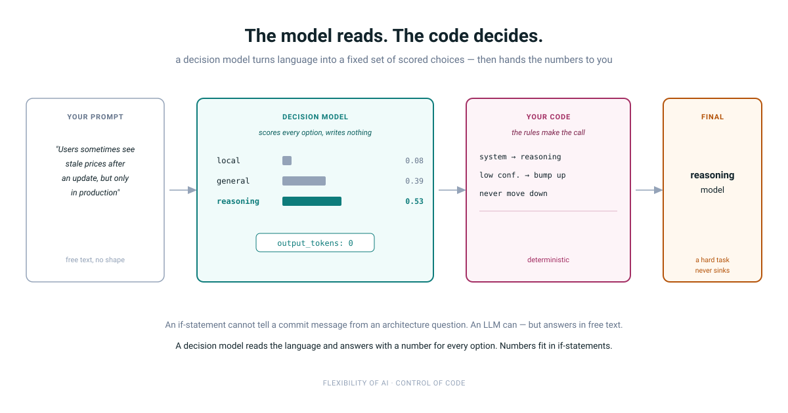

import Callout from '@components/Callout.astro';



<p class="lede">
  Code is deterministic but cannot read language. An LLM reads language but answers in free text.
  A decision model fills the gap between them: it returns one choice from a fixed list, with a
  probability for every option — and your code makes the final call.
</p>

As developers, we have two main tools for building logic.

The first is **code**. Code is deterministic. The same input always gives the same output. But code does not understand language. An `if` statement cannot tell a commit message request from an architecture question.

The second is an **LLM**. An LLM understands language very well. But its output is free text. It can be long, short, or in a shape you did not expect. You need to parse it, validate it, and hope it follows your format.

There is a gap between these two. A **decision model** fills it.

## What is a decision model?

A decision model does not write text. It makes a choice.

You give it three things:

1. A question, like "Which tier should handle this?"
2. A fixed list of options.
3. The input to judge.

It returns one of your options. It also returns a probability for every option. That is all.

In my setup, I run a decision model called Laya on a local unsloth server. Look at the usage field in a response:

```json
"usage": { "input_tokens": 166, "output_tokens": 0 }
```

Zero output tokens. The model reads the input and scores the options. It never generates text, so it never goes off-format.

## Example: a model router (POC)

I use AI models for coding tasks. Some tasks are trivial, like writing a commit message. Some are hard, like planning a migration. Sending everything to the biggest model wastes money. Sending everything to a small local model gives bad answers on hard tasks.

So I built a small router. A prompt goes in. A model id comes out.

### The schema

The router asks Laya two questions. The first is about the kind of task. The second is about how much code it touches.

```json
{
  "model": "laya",
  "state": "",
  "questions": {
    "tier": {
      "type": "choice",
      "instructions": "Which model tier should handle this? Pick the cheapest tier that can do it well. If unclear or risky, pick the higher tier.",
      "criteria": {
        "local":     ["commit messages", "renames and typos", "formatting and lint fixes"],
        "general":   ["implement a feature", "write or fix tests", "fix a bug with a clear error"],
        "reasoning": ["system design and architecture", "choosing between technologies", "root cause analysis"]
      }
    },
    "scope": {
      "type": "choice",
      "instructions": "How much code or system does this task touch?",
      "criteria": {
        "single": ["one line or function", "one file", "nothing else changes"],
        "multi":  ["several files or modules", "one project", "changes must stay consistent"],
        "system": ["many services or repos", "infrastructure or deployment", "data layer or architecture"]
      }
    }
  }
}
```

The criteria lists are shortened here. The real file has more items — both files are printed in full under "The full files" below. The script joins each list into one string before it sends the request.

The user's prompt goes into `state`. Then the script calls the endpoint with `curl`.

### The response

Each answer has a choice, a confidence, and the probabilities:

```json
"tier": {
  "type": "choice",
  "choice": "reasoning",
  "confidence": 0.17,
  "probabilities": { "local": 0.08, "general": 0.39, "reasoning": 0.53 }
}
```

Confidence is `1 - (entropy / ln N)`. It shows how peaked the spread is. A value of 1.0 means all weight is on one option. A value of 0.0 means all options are equal. It is not "the chance the answer is right." It is "how sure the model sounds."

### The rules

<Callout tag="The important part">
  The model makes a judgment. **Code makes the final decision.**
</Callout>

```bash
# Scope and low confidence can move the tier UP, never down.
# (Simplified. is_below is a small awk number comparison.)
if [ "${FINAL}" = "local" ] && is_below "${TIER_CONF}" "${MIN_CONF}"; then
  FINAL="general"
fi

case "${SCOPE}" in
  system) FINAL="reasoning" ;;
  multi)  [ "${FINAL}" = "local" ] && FINAL="general" ;;
esac
```

The rules are simple:

- System scope always goes to the reasoning model.
- Multi-file scope never stays on the local model.
- A "local" pick with low confidence moves to general.
- Rules only move up. A hard task should never go to the small model by mistake.

### The full files

Both files are below in full, collapsed. Expand to read, or download and run. Nothing secret: the API key is read from `UNSLOTH_API_KEY`, and the endpoint is a `localhost` placeholder you point at your own server.

<details class="file-details">
<summary>
  <span>router.sh — the script</span>
  <a href="/posts/decision-models-the-space-between-code-and-llms/router.sh" download onclick="event.stopPropagation()">download</a>
</summary>

```bash
#!/usr/bin/env bash
#
# Model router (POC). Prompt in, destination model id out.
#
#   ./router.sh "write a commit message"
#   ROUTER_SCHEMA=./other.json ./router.sh "..."   # A/B a criteria set
#   ROUTER_MIN_CONF=0.3 ./router.sh "..."          # stricter local gate
#
# router.json (next to this script) asks Laya two questions:
#   tier  - local | general | reasoning   (what kind of task)
#   scope - single | multi | system       (how much code it touches)
# The prompt is injected as "state". Edit the criteria there to change routing.
# Criteria can be a string or an array of short phrases. Arrays are joined
# into one comma-separated string before the request is sent.
#
# Routing rule: scope and low confidence can move the tier UP, never down.
#   - unknown tier            -> general
#   - local + low confidence  -> general
#   - local + multi scope     -> general
#   - any tier + system scope -> reasoning
#
# The final model id goes to stdout. Debug lines go to stderr.

set -euo pipefail

LOCAL_MODEL="local-9b"            # TODO: id you actually serve locally
GENERAL_MODEL="claude-sonnet-5-5"
REASONING_MODEL="claude-opus-5-5"

ENDPOINT="${ROUTER_ENDPOINT:-http://localhost:8888/v1/systemone}"  # your unsloth server

DIR="$(cd -- "$(dirname -- "${BASH_SOURCE[0]}")" && pwd)"
PROMPT="${1:?usage: router.sh '<prompt>'}"
KEY="${UNSLOTH_API_KEY:?UNSLOTH_API_KEY is not set}"
SCHEMA_FILE="${ROUTER_SCHEMA:-${DIR}/router.json}"
MIN_CONF="${ROUTER_MIN_CONF:-0.2}"  # below this, a "local" pick is not trusted

log() { printf '%s\n' "$*" >&2; }

# --- Ask Laya ----------------------------------------------------------------

RESPONSE="$(curl --silent --show-error --fail "${ENDPOINT}" \
  --header "Authorization: Bearer ${KEY}" \
  --header "Content-Type: application/json" \
  --data-binary "$(jq --arg s "${PROMPT}" '
    .state = $s
    | .questions |= map_values(
        .criteria |= map_values(if type == "array" then join(", ") else . end)
      )' "${SCHEMA_FILE}")")"

# Response shape (confirmed live, tier only; scope follows the same shape):
#   {"model":"laya-multilingual",
#    "answers":{"tier":{"type":"choice","choice":"reasoning","confidence":0.17,
#              "probabilities":{"local":0.08,"general":0.39,"reasoning":0.53}}},
#    "usage":{"input_tokens":166,"output_tokens":0}}
#
# confidence is 1 - (entropy / ln N), i.e. how PEAKED the spread is, not how
# likely the choice is correct. 1.0 = one-hot, 0.0 = uniform. Low here means
# the model had no opinion -- which is what MIN_CONF is for.

# --- Debug output ------------------------------------------------------------

printf '%s' "${RESPONSE}" | jq -r '
  def show($name):
    .answers[$name] as $a
    | "\($name):  \($a.choice // "none")  confidence \($a.confidence // "?")"
      + "\n  " + ($a.probabilities // {} | to_entries
                  | map("\(.key)=\(.value)") | join("  "));
  show("tier"), show("scope")' >&2

# --- Read answers ------------------------------------------------------------

IFS=$'\t' read -r TIER SCOPE TIER_CONF < <(
  printf '%s' "${RESPONSE}" | jq -r '
    [ .answers.tier.choice      // "none",
      .answers.scope.choice     // "none",
      .answers.tier.confidence  // 0 ] | @tsv'
)

# --- Apply routing rules (only move up) --------------------------------------

FINAL="${TIER}"

case "${FINAL}" in
  local|general|reasoning) ;;
  *)
    log "bump:   unknown tier '${TIER}' -> general"
    FINAL="general"
    ;;
esac

if [ "${FINAL}" = "local" ] \
   && awk -v c="${TIER_CONF}" -v m="${MIN_CONF}" 'BEGIN { exit !(c < m) }'; then
  log "bump:   local with low confidence (${TIER_CONF} < ${MIN_CONF}) -> general"
  FINAL="general"
fi

case "${SCOPE}" in
  system)
    if [ "${FINAL}" != "reasoning" ]; then
      log "bump:   scope=system -> reasoning"
      FINAL="reasoning"
    fi
    ;;
  multi)
    if [ "${FINAL}" = "local" ]; then
      log "bump:   scope=multi -> general"
      FINAL="general"
    fi
    ;;
esac

log "final:  ${FINAL}"

# --- Output model id ---------------------------------------------------------

case "${FINAL}" in
  local)     echo "${LOCAL_MODEL}" ;;
  reasoning) echo "${REASONING_MODEL}" ;;
  *)         echo "${GENERAL_MODEL}" ;;
esac
```

</details>

<details class="file-details">
<summary>
  <span>router.json — the schema</span>
  <a href="/posts/decision-models-the-space-between-code-and-llms/router.json" download onclick="event.stopPropagation()">download</a>
</summary>

```json
{
  "model": "laya",
  "state": "",
  "questions": {
    "tier": {
      "type": "choice",
      "instructions": "Which model tier should handle this? Pick the cheapest tier that can do it well. If unclear or risky, pick the higher tier.",
      "criteria": {
        "local": [
          "commit messages",
          "branch names and PR titles",
          "renames and typos",
          "formatting and lint fixes",
          "simple boilerplate",
          "JSON, YAML, CSV conversion",
          "one-line shell commands"
        ],
        "general": [
          "implement a feature",
          "write or fix tests",
          "refactor a module",
          "fix a bug with a clear error",
          "write documentation",
          "review a small diff",
          "write SQL or scripts",
          "explain existing code"
        ],
        "reasoning": [
          "system design and architecture",
          "choosing between technologies",
          "tradeoff analysis",
          "break down a large task",
          "security review",
          "unclear performance problems",
          "concurrency and race conditions",
          "schema design and data migrations",
          "root cause analysis"
        ]
      }
    },
    "scope": {
      "type": "choice",
      "instructions": "How much code or system does this task touch?",
      "criteria": {
        "single": ["one line or function", "one file", "nothing else changes"],
        "multi": ["several files or modules", "one project", "changes must stay consistent"],
        "system": ["many services or repos", "infrastructure or deployment", "data layer or architecture"]
      }
    }
  }
}
```

</details>

## Real results

Here are four real runs:

| Prompt | Tier (confidence) | Scope (confidence) | Final |
|---|---|---|---|
| Write a commit message for the changes | local (0.57) | single (0.36) | local |
| This test fails with TypeError: Cannot read properties of undefined | general (0.13) | single (0.59) | general |
| We have a monolith with 40 modules. How should we split it into microservices? | reasoning (0.27) | multi (0.31) | reasoning |
| Users sometimes see stale prices after an update, but only in production | general (0.10) | system (0.03) | **reasoning** (bumped) |

All four went to the right model. But the numbers tell a more useful story.

**The commit message** was easy. Local got 86% of the weight.

**The failing test** went to general, which is right. But confidence was low. Local still got 31%. A short error message looks "small" to the model.

**The monolith question** went to reasoning. But scope came back as `multi`, not `system`. I expected `system`. Here the tier question was right, and it was enough.

**The stale prices bug** is the interesting one. The tier question picked `general`, with a very flat spread. Alone, this would send a hard production bug to a mid-tier model. But scope picked `system`, and the rule moved it up to reasoning.

I must be honest here. The scope confidence was only 0.03. That is almost a coin toss. The rule saved this case, but a bit of luck helped. This prompt tells me where to improve my criteria. Intermittent, production-only bugs need a clearer hint.

This shows why two questions are better than one. Each question is a second chance to catch a mistake.

## Why "semi-deterministic" matters

Think of the three approaches side by side:

| | Code | LLM | Decision model + code |
|---|---|---|---|
| Understands language | No | Yes | Yes |
| Output shape | Fixed | Free text | Fixed set of options |
| Needs parsing | No | Yes, and it can fail | No |
| Gives a measure of certainty | No | Not really | Yes, per option |
| You control the final rule | Yes | Hard | Yes |

The model handles the fuzzy part: reading language. The code handles the strict part: what to do with the result. You get the flexibility of AI with the control of normal programming.

The probabilities are the real gift. With an LLM, you get an answer and nothing else. With a decision model, you get numbers. Numbers can go into `if` statements. You can set thresholds. You can escalate when the model is unsure. You can log everything and tune later.

## Other places to use this

The router is only one example. The same pattern fits many features:

- **Incident triage**: classify an alert as `cosmetic`, `degraded`, or `down`, then page the right person.
- **Support tickets**: route to billing, technical, or sales.
- **Pull request risk**: label a diff as low, medium, or high risk before review.
- **Intent detection**: decide if a chat message is a question, a command, or a complaint.
- **Content checks**: flag text as safe, needs review, or block.

In each case, the model reads. The code decides.

## Lessons from building it

A few things I learned:

1. **Labels must describe the input, not your system.** A label like `local` means nothing to the model. A label like `trivial edit` does. If you use short labels, pick common words with a clear meaning.
2. **Shorter criteria work better.** Long option descriptions add noise. Short phrases make the signal stronger.
3. **Only move up.** When you combine signals, let them escalate, never downgrade. It is cheaper to overpay a little than to give a bad answer.
4. **Build an eval set early.** Collect 20 to 30 real prompts. Write down the tier you expect. Run them after every criteria change.
5. **Watch low-confidence results.** They show you exactly where your criteria are weak.

## Wrapping up

Decision models are not a replacement for LLMs or for code. They are a new layer between them. They turn natural language into a small, fixed set of choices. Then your code takes over.

For many features, this is exactly what we need. We don't want the AI to write the answer. We want it to help us choose.
