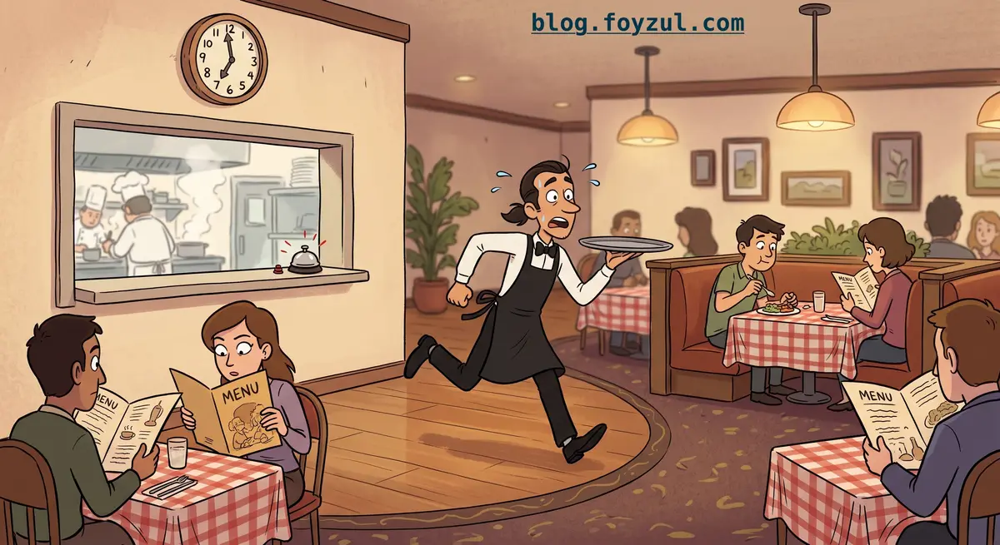
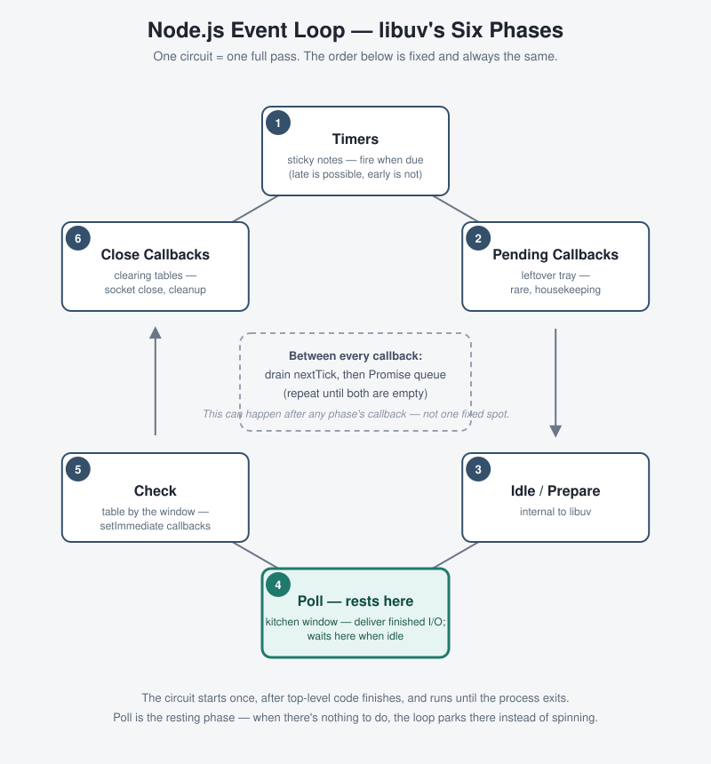
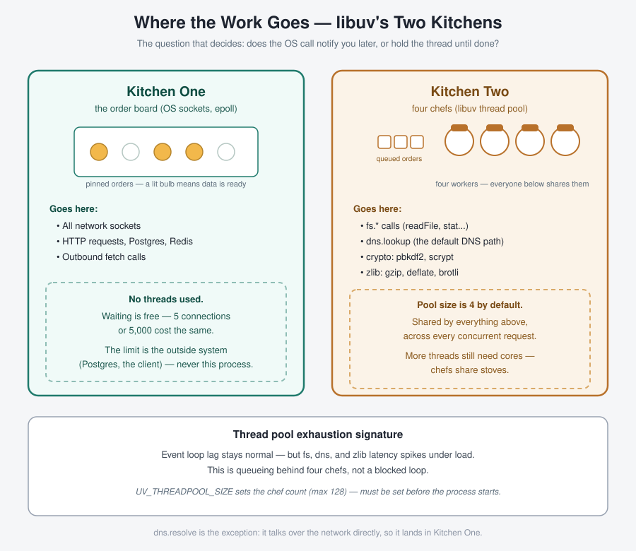

import Figure from '@components/Figure.astro';
import Callout from '@components/Callout.astro';
import Eyebrow from '@components/Eyebrow.astro';
import EmbedFrame from '@components/EmbedFrame.astro';
import Quiz from '@components/Quiz.astro';
import QuizItem from '@components/QuizItem.astro';

  Your JavaScript runs one function at a time. A Node server still handles thousands of
  connections at once. This is Module 1 of a series on Node.js performance, and it explains
  how those two facts fit together — with one picture: a waiter running a circuit between
  two kitchens.

Your JavaScript runs on one thread. It has one call stack and runs one function at a time. The Node process that runs your JavaScript is not single-threaded, though. It has other threads too: the garbage collector, the libuv thread pool, and the operating system doing socket work underneath it all. The event loop is the link between your one thread and everything else.

Everything in this post hangs off one picture: a single waiter running an endless circuit around a restaurant. The waiter never cooks. They take an order, hand it to a kitchen, and move on. When something is ready, a bell rings and the waiter delivers it. That is the whole shape of Node.

| Restaurant | Node |
|---|---|
| The waiter | The JavaScript thread |
| The waiter's fixed circuit | The event loop |
| Kitchen one — the order board | OS non-blocking sockets (epoll) |
| Kitchen two — four chefs | The libuv thread pool |
| The waiter's two pockets | Microtask queues (`nextTick`, promises) |

The rest of the post fills in that table, one row at a time. First the circuit, then the kitchens, then how the two connect.

<Eyebrow num="1.1">The circuit</Eyebrow>

## The event loop

The event loop is a real `while` loop inside libuv. Each pass calls a fixed sequence of steps — six phases — and each phase drains one queue. Nothing mystical: "phase" means "this queue gets emptied now."

Three facts carry the whole section.

1. **The circuit starts once.** It begins after your top-level code finishes, and runs until the process exits. Nothing restarts it, and requests do not trigger it.
2. **Async work starts mid-step.** Your code starts an async operation inside a callback, without the waiter stopping.
3. **The waiter does one thing at a time.** A slow callback stalls every table, not just one.

### The six phases

| # | Phase | What it is |
|---|---|---|
| 1 | Timers | Sticky notes — fire when due. Late is possible, early is not. |
| 2 | Pending callbacks | A small leftover tray — rare, housekeeping. |
| 3 | Idle / prepare | Internal to libuv. |
| 4 | Poll | The kitchen window — deliver finished I/O. The loop rests here when idle. |
| 5 | Check | The table right by the window — `setImmediate` callbacks. |
| 6 | Close callbacks | Clearing empty tables — socket close, cleanup. |

Here is the circuit as a diagram. Poll is highlighted because it is not just one stop among six. It is the resting spot: when there is nothing to do, the loop parks there instead of spinning.

<Figure eyebrow="The six phases, in order" caption="The event loop as a circuit. Poll is where the loop waits when the queues are empty.">
  
</Figure>

### Microtasks run between the steps

Microtasks are the exception to the circuit. They run *between* steps, not as one of the six phases. After every single callback finishes, before the waiter picks up the next one, two pockets get emptied completely: `process.nextTick` first, then the promise reaction queue. If emptying them adds more, those get emptied too, before anything else happens.

<Callout tag="Why this matters">
  **A microtask that keeps scheduling another microtask holds the waiter in place forever.** The
  loop never reaches poll, timers never fire, sockets never get read. CPU sits at 100%, the process
  looks alive, but nothing is being served. The only real way to yield to the loop is
  `setImmediate`, because it is an actual step in the circuit. `nextTick` and resolved promises
  are not.
</Callout>

### What blocks the loop

Anything that keeps the waiter busy for a long time blocks the loop. The usual suspects:

| Blocker | Why it sneaks in |
|---|---|
| Synchronous I/O | Fine at startup, deadly inside a request handler. |
| CPU-heavy JavaScript | Big loops, sorting, pure-JS image work. |
| Large `JSON.parse` / `JSON.stringify` | Does not feel heavy. A 10 MB body is tens of milliseconds blocked. The most common blocker in API servers. |
| Catastrophic regex backtracking | Bad pattern + hostile input = seconds. Lives inside validation libraries. |
| Synchronous crypto | Hashing is *designed* to be slow. On the loop, one login blocks everyone. |
| React server rendering (`renderToString`) | CPU-heavy JS on the loop. In a server that renders React, this is the biggest legitimate blocker. |

### Watch the loop run

The diagram above is a map. In reality the loop never stops — it is always mid-circuit. The animation below starts on its own. Watch the single red dot — the one JavaScript thread — travel the circuit. Poll gets a visibly longer stop, because it is the resting phase. Use **Step** to freeze on exactly one phase at a time.

<Figure eyebrow="Animated" caption="The loop, running continuously. The red dot is the JavaScript thread." frame={false}>
  <EmbedFrame src="/posts/event-loop-and-libuv/embeds/event-loop.html" title="Animated event loop" height={1010} />
</Figure>

<Eyebrow num="1.2">The kitchens</Eyebrow>

## libuv and the two kitchens

Every async operation in Node goes to one of two places. The question that decides which is simple: does the OS call return immediately and notify you later, or does it hold the calling thread until it is done?

<Callout tag="Kitchen one — the order board">
  All network I/O — HTTP requests, Postgres, outbound fetch, Redis. libuv hands the socket to the
  OS (epoll on Linux) and gets notified later. **No threads involved.** Five connections or five
  thousand cost the same. The limit is always the outside system — Postgres, the client — never
  this process.
</Callout>

<Callout tag="Kitchen two — four chefs">
  Some OS calls are blocking, so libuv sends a worker thread to make the call and wait. This is
  where `fs.*`, `dns.lookup` (the default DNS path), async crypto, and zlib all go. The pool has
  **4 threads by default** — `UV_THREADPOOL_SIZE`, which must be set before the process starts —
  shared by everything on that list, across every concurrent request.
</Callout>

When kitchen two runs out of chefs, the symptom is distinctive once you know it: event loop lag stays completely normal, but file, DNS, and compression latency spikes under load. It is not blocking — it is queueing behind four workers. That difference matters later, when reading a profile in Module 2 of this series: it shows up as off-CPU time (waiting), not on-CPU time (working).

<Figure eyebrow="Where the work goes" caption="Kitchen one never queues. Kitchen two has four chefs, and work waits when they are all busy.">
  
</Figure>

### Watch it happen live

The animation below runs light traffic for the first few seconds, and both kitchens keep up easily. Then a burst: ten outbound `dns.lookup` calls fire at once. Kitchen one just lights up more bulbs on the board, with no slowdown at all. Kitchen two's four chefs saturate, and a real queue forms and drains. Watch the live counters on each panel.

<Figure eyebrow="Animated" caption="Scripted traffic, including one burst. Kitchen two queues; kitchen one does not." frame={false}>
  <EmbedFrame src="/posts/event-loop-and-libuv/embeds/two-kitchens.html" title="Animated two kitchens" height={900} />
</Figure>

<Callout tag="DNS gets its own post">
  `dns.lookup` vs `dns.resolve`, why almost every library defaults to the thread-pool path, and
  the fan-out trap in a backend-for-frontend that calls many upstream services — that is a full
  post on its own, coming later in this series.
</Callout>

<Eyebrow num="1.1 + 1.2">Putting it together</Eyebrow>

## Both halves, one system

These are not two unrelated diagrams. A request gets dispatched while some callback is executing, wherever the loop happens to be at that moment. The actual work then happens in a kitchen, entirely on its own clock, independent of the loop's pace.

<Callout tag="The one sentence to keep">
  **Results do not appear back in your code the instant they are ready.** They only get collected
  the next time the loop's circuit reaches **poll**. That is why a busy loop delays I/O callbacks
  even when the kitchen finished the work long ago.
</Callout>

In the animation below, watch what happens after the burst. Kitchen two finishes cooking everything by around six seconds in — but poll already passed by then (it ran roughly 2.85 to 4.65 seconds into this lap). So the results just sit there, glowing, waiting. Poll does not come back around until about 9.65 seconds, and when it does, the entire backlog gets swept up and delivered at once.

<Figure eyebrow="Animated" caption="The merged system: dispatch, cook, and the poll-gated delivery." frame={false}>
  <EmbedFrame src="/posts/event-loop-and-libuv/embeds/merged.html" title="Animated merged event loop and kitchens" height={1660} />
</Figure>

## Check your understanding

You do not need to write these down. Try each one in your head first, then open the answer to compare.

<Quiz>
  <QuizItem>
    <Fragment slot="question">When does the event loop start, and what makes it stop?</Fragment>

    It starts once, after your top-level code has finished running. Nothing restarts it, and
    incoming requests do not trigger it; they are just work it finds on the next lap. It stops
    when there is nothing left that could produce work: no pending timers, no open sockets or
    handles, and no outstanding thread-pool jobs. At that point the process exits on its own.
  </QuizItem>

  <QuizItem>
    <Fragment slot="question">Which phase does the loop rest in when idle?</Fragment>

    Poll. When every queue is empty, libuv asks the operating system to wait for I/O, and the
    thread sleeps using no CPU. The wait has a timeout equal to the time until the nearest timer
    is due, so the waiter wakes either when a bell rings or when a timer needs to fire. If a
    `setImmediate` callback is waiting, the timeout is zero and the loop does not rest at all.
  </QuizItem>

  <QuizItem>
    <Fragment slot="question">Why does `setImmediate` beat `setTimeout(0)` inside an I/O callback?</Fragment>

    An I/O callback runs during the poll phase. The next stop on the circuit is check, which is
    where `setImmediate` callbacks run. The timers phase comes only after the loop finishes the
    lap and starts the next one. So from inside poll, `setImmediate` is always one stop away and
    `setTimeout(0)` is most of a lap away. Outside an I/O callback, in the main module for
    example, the order between the two is not guaranteed.
  </QuizItem>

  <QuizItem>
    <Fragment slot="question">Describe microtask starvation in two sentences, without using the word "queue."</Fragment>

    Before the waiter takes a single step, they empty both pockets, and if emptying a pocket
    puts something new into it, they empty it again. A microtask that always schedules another
    microtask keeps refilling the pocket, so the waiter never takes that step, poll is never
    reached, and no I/O or timer is ever served while the CPU sits at 100%.
  </QuizItem>

  <QuizItem>
    <Fragment slot="question">Name five blockers. Which one is most common in API servers?</Fragment>

    Synchronous I/O inside a request handler, CPU-heavy JavaScript such as big loops or sorting,
    large `JSON.parse` or `JSON.stringify` calls, catastrophic regex backtracking, synchronous
    crypto such as hashing, and React server rendering. The most common in API servers is the
    large JSON work, because it never looks heavy in the code. A 10 MB body costs tens of
    milliseconds, and every request pays it.
  </QuizItem>

  <QuizItem>
    <Fragment slot="question">What is the one question that decides whether an operation goes to kitchen one or kitchen two?</Fragment>

    Does the operating system call return immediately and notify you later, or does it hold the
    calling thread until the work is done? Sockets are the first kind, so network I/O goes to
    kitchen one, the order board, and costs no thread. File system calls, `dns.lookup`, and
    most crypto and compression calls are the second kind, so libuv gives them to a worker in
    kitchen two, the thread pool.
  </QuizItem>

  <QuizItem>
    <Fragment slot="question">What is the default thread pool size, and name four things that share it.</Fragment>

    Four threads. You can change it with the `UV_THREADPOOL_SIZE` environment variable, but only
    before the process starts. The pool is shared by all `fs.*` calls, `dns.lookup` (which is
    the default DNS path for almost every library), the asynchronous crypto functions such as
    `pbkdf2` and `randomBytes`, and zlib compression. Every concurrent request draws from the
    same four workers.
  </QuizItem>

  <QuizItem>
    <Fragment slot="question">Describe the thread-pool exhaustion signature. How does it differ from a blocked loop?</Fragment>

    Event loop lag stays normal, but file, DNS, and compression latency spikes under load. The
    waiter is fine; the four chefs are all busy and new orders wait for a free one. In a profile
    this shows up as off-CPU time, meaning waiting. A blocked loop looks different: lag itself
    rises, and everything slows down at once, including network callbacks and timers that never
    touch the thread pool, because the waiter is stuck on one table.
  </QuizItem>

  <QuizItem>
    <Fragment slot="question">Why is "just raise `UV_THREADPOOL_SIZE` to 128" not automatically correct?</Fragment>

    Threads are not free. Each one holds a stack and adds scheduling work for the operating
    system, and 128 threads fighting over a few CPU cores or one disk can be slower than four.
    It also hides the real cause. If the pool is full of `dns.lookup` calls, the fix is
    `dns.resolve` or a cache, not more chefs. Raise it only after measuring that the pool is the
    bottleneck and that the underlying resource can absorb the extra parallel work.
  </QuizItem>

  <QuizItem>
    <Fragment slot="question">A kitchen finishes cooking a request at the 30% mark of a lap, but poll for that lap already happened at the 20% mark. When does the result actually get delivered?</Fragment>

    At the poll phase of the next lap. Finished work is only collected when the waiter reaches
    the kitchen window, and the waiter has already passed it for this lap. So the plate sits
    ready for about 90% of a lap before anyone picks it up. This is why a busy loop delays I/O
    callbacks even when the actual work finished long ago, and it is what the last animation
    shows after the burst.
  </QuizItem>
</Quiz>

The next module moves one layer down, to V8: how the engine runs the JavaScript the waiter carries, and what that costs.
