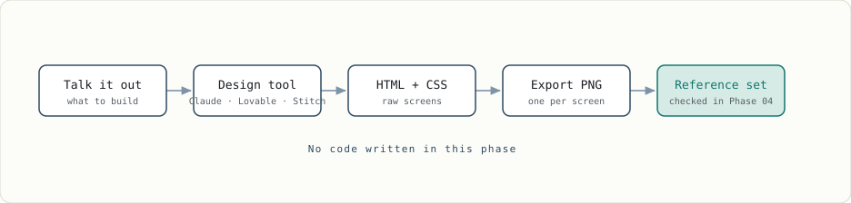
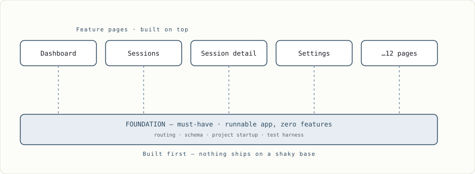
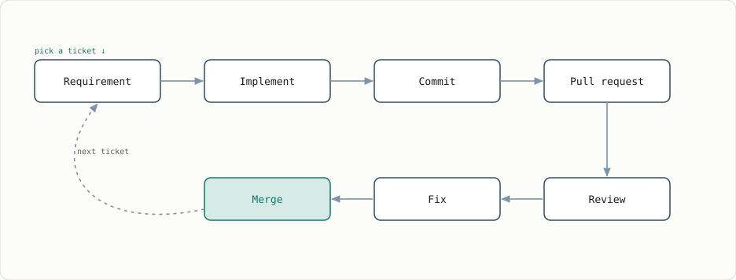

import Figure from '@components/Figure.astro';
import Eyebrow from '@components/Eyebrow.astro';

  Agentic engineering শুধু দ্রুত code generate করার নাম না। আসল value তৈরি হয় code লেখার
  আগে নেওয়া decision-গুলোতে, আর ship করার পরে পাওয়া evidence-এ।

বাংলাদেশের software engineer হিসেবে AI agent ব্যবহার করতে চাইলে শুধু একটা working app দেখানো এখন আর যথেষ্ট না। Recruiter বা engineering manager-কে দেখাতে হবে, আপনি problem কীভাবে ভেঙেছেন, architecture কেন বেছে নিয়েছেন, risk কোথায় দেখেছেন, আর output ঠিক কি না কীভাবে যাচাই করেছেন। [claude-lens](https://github.com/foyzulkarim/claude-lens) বানানোর সময় আমি এই পুরো process public-এ রেখেছি। সেই অভিজ্ঞতা থেকে idea থেকে production feedback পর্যন্ত একটা repeatable lifecycle এখানে তুলে ধরছি।

একটা LLM পুরো codebase ঘেঁটে option propose করতে পারে, code draft করতে পারে এবং tool run করতে পারে—অনেক ক্ষেত্রেই আপনার চেয়ে দ্রুত। কিন্তু system define করা, constraint set করা, risk approve করা, evidence যাচাই করা এবং outcome-এর ownership নেওয়া আপনার কাজ। Model আর আপনার মাঝখানে তাই কিছু gate দরকার—test, acceptance criteria, review এবং security policy—যাতে যাচাই ছাড়া কিছু production-এর দিকে এগোতে না পারে।

<Figure
  bleed
  scroll
  frame={false}
  caption="এটাই পুরো lifecycle-এর operating contract: model কাজ করে, gate যাচাই করে, আর outcome-এর ownership আপনার থাকে।"
>
  
</Figure>

ডান দিকের column-টাই সবচেয়ে গুরুত্বপূর্ণ। Agent-এর ভুল production পর্যন্ত পৌঁছালে incident review-তে model উত্তর দেবে না; stakeholder-এর সামনে আপনাকেই দাঁড়াতে হবে। কাজ করার authority agent-কে দেওয়া যায়, কিন্তু outcome-এর accountability আপনার কাছেই থাকে।

এই lifecycle-এ সাতটা phase আছে। প্রথম পাঁচটায় আপনি কাজটি define এবং sequence করবেন; actual implementation শুরু হবে Phase 06-এ।

<Figure
  bleed
  scroll
  frame={false}
  caption="প্রথম পাঁচটি phase-এ কাজ define এবং sequence হয়। Build শুরু হয় Phase 06-এ, আর production evidence আবার spec-এ ফিরে আসে।"
>
  
</Figure>

<Eyebrow num="Phase 01">Concept</Eyebrow>

## আসল code লেখার আগেই idea-টা HTML-এ দাঁড় করান

শুরুতে Claude বা ChatGPT-র সঙ্গে আলোচনা করুন *কী* বানাতে চান তা নিয়ে। এখনই in-depth feature spec দরকার নেই; আগে user, problem, product-এর boundary এবং মূল experience পরিষ্কার করুন।

Rough mockup দাঁড়িয়ে গেলে Claude, Lovable বা Google Stitch-এর মতো design tool দিয়ে screen generate করুন। Output হিসেবে full React app না নিয়ে raw **HTML এবং CSS** নিন। [claude-lens](https://github.com/foyzulkarim/claude-lens)-এ আমি প্রতিটি HTML screen-কে PNG-তে export করেছিলাম, যাতে পরে implementation-এর সঙ্গে একটি স্থির visual reference থাকে।

<blockquote>"HTML রাখলেই তো হতো, PNG কেন?"</blockquote>

Modern model multimodal হওয়ায় image-কে সরাসরি input হিসেবে নিতে পারে। ফলে পরে model বা visual test-কে PNG reference দিয়ে জিজ্ঞেস করা যায়, implementationটি intended design-এর সঙ্গে মিলছে কি না। শুধু নিজের স্মৃতির ওপর নির্ভর করতে হয় না।

HTML এখানে sketchpad—সহজে বদলানো বা ফেলে দেওয়া যায়। PNG হলো fixed reference। Build phase-এ automated browser running app-এর screenshot নিয়ে এই reference-এর সঙ্গে compare করতে পারবে।

এই phase-এ ইচ্ছা করেই **stack pick করবেন না।** HTML regenerate করতে বা ফেলে দিতে খুব কম খরচ হয়, কিন্তু React app দিয়ে শুরু করলেই একটি architectural commitment তৈরি হয়। Requirement পরিষ্কার হওয়ার আগে stack বেছে নিলে পরে problem-এর জন্য সঠিক tool খোঁজার বদলে নিজের আগের choice-কে justify করতেই সময় চলে যায়।

Phase 1-এর output তাই খুব ছোট: raw HTML/CSS prototype এবং প্রতিটি গুরুত্বপূর্ণ screen-এর PNG reference। এটি portfolio project হলেও production-grade engineering habits দেখানোর জন্যই আপনি পরের phase-গুলো অনুসরণ করবেন।

<Figure
  bleed
  scroll
  frame={false}
  caption="Design → export → freeze। এই PNG-গুলোই স্থির reference; implementation-এর screenshot পরে এগুলোর সঙ্গে compare হবে।"
>
  
</Figure>

বাংলাদেশ থেকে এসব tool-এর subscription কেনা সব সময় সহজ নয়; international card লাগতে পারে এবং সরাসরি BDT payment-এর option সাধারণত থাকে না। তবে Phase 1-এর জন্য paid plan বাধ্যতামূলক নয়। Claude ও ChatGPT-এর free version এবং Lovable বা Stitch-এর free credit দিয়েই একটি concept prototype তৈরি করা যায়।

<Eyebrow num="Phase 02">Architect</Eyebrow>

## দুই ধরনের feature, আর যে তর্ক ঠিক করে দেয় কোনটা কী

এখন HTML এবং PNG reference-এর সঙ্গে architecture নিয়ে আলোচনা শুরু করুন। Schema কেমন হবে, routing কীভাবে কাজ করবে, project কীভাবে boot করবে এবং test harness কোথায় বসবে—এসব হলো **foundational feature**। Dashboard, session page বা settings-এর মতো user-facing অংশগুলো হলো **product feature**, যেগুলো foundation-এর ওপর দাঁড়াবে।

Technology decision নেওয়ার সময়ও এখনই। [claude-lens](https://github.com/foyzulkarim/claude-lens)-এর data layer নিয়ে আলোচনায় প্রথম প্রশ্ন ছিল: local, single-user tool যদি append-only log পড়ে, তাহলে Postgres কি সত্যিই দরকার? কয়েক round argument-এর পরে আমি পরিচিত relational stack বাদ দিয়ে delta-based model নিয়েছিলাম। পরিচিত tool এবং problem-এর জন্য সঠিক tool এক জিনিস না; architecture phase-এর কাজ হলো সেই পার্থক্যটি evidence দিয়ে বের করা।

### যে এজেন্ট আপনার সাথে একমত হতে চায়, তার সাথে তর্ক করবেন কীভাবে

Architecture discussion-এ একটা position নেওয়া ভালো, কিন্তু model কখন evidence-এর কারণে একমত হচ্ছে আর কখন আপনার wording অনুসরণ করছে—দুটো আলাদা করতে হবে। আপনি একটি direction-এ বেশি push করলে model সেই direction-এর পক্ষেই argument তৈরি করতে পারে, আপনি ঠিক হোন বা ভুল। তাই লক্ষ্য **তর্কে জেতা না; যাচাই করা যায় এমন material বের করা।**

ধরুন আপনি মনে করছেন Postgres লাগবে না। শুধু বলবেন না, “Postgres unnecessary, agree?” বরং বলুন:

- Postgres নেওয়ার পক্ষে সবচেয়ে শক্ত case-টা বানাও।
- কোন workload-এ delta model ভেঙে পড়বে?
- ছয় মাস পরে কোন limitation নিয়ে সবচেয়ে বেশি আফসোস হতে পারে?
- কোন assumption ভুল প্রমাণিত হলে এই decision বদলাতে হবে?
- তোমার recommendation-এর বিরুদ্ধে strongest counter-argument কী?

“আপনি ঠিক বলেছেন” কোনো useful output না। কিন্তু “একটা session log 50 MB ছাড়ালে full replay latency unacceptable হতে পারে”—এটা useful। কারণ এটা measurable, testable, এবং পরে verify করা যায়।

**Agreement-কে noise ধরুন। Specificity-কে signal ধরুন।**

Decision-টা chat log-এর মধ্যে ফেলে রাখবেন না। কয়েক সপ্তাহ পর context এবং reasoning দুটোই হারিয়ে যাবে। প্রতিটি গুরুত্বপূর্ণ decision পাঁচটি অংশে লিখে রাখুন:

1. **Context** — কোন problem solve করছিলেন
2. **Options** — কোন বিকল্পগুলো দেখেছিলেন
3. **Decision** — শেষ পর্যন্ত কী নিলেন
4. **Trade-off** — এর জন্য কী ছাড়লেন
5. **Tripwire** — কী ঘটলে decision-টা আবার খুলবেন

এটাই Architecture Decision Record বা ADR। যে subsystem-কে explain করছে, repo-তে তার কাছাকাছি রাখুন। শেষের **tripwire** অংশটি বিশেষভাবে গুরুত্বপূর্ণ। “Delta model নিয়েছি কারণ simpler মনে হয়েছে”—এটি কয়েক মাস পর কাজে আসবে না। কিন্তু একটি measurable condition decisionটি আবার খোলার সময় বলে দিতে পারে:

> একটি session log 50 MB ছাড়ালে, অথবা startup replay দুই সেকেন্ডের বেশি হলে storage model আবার evaluate করব।

এই record লিখতে দশ মিনিট লাগতে পারে, কিন্তু এটি একটি confident chat response-কে চুপচাপ permanent architecture হয়ে যাওয়া থেকে আটকায়।

<Figure
  bleed
  scroll
  frame={false}
  caption="প্রতিটি product feature shared foundation-এর ওপর দাঁড়ায়, তাই feature build করার আগে base-এর plan ঠিক করুন।"
>
  
</Figure>

<Eyebrow num="Phase 03">Foundation plan</Eyebrow>

## Feature-এর আগে runnable foundation-টা plan করুন

এই phase-এ foundation implement করবেন না; Build phase-এ কোন order-এ implement হবে, সেই plan বানাবেন। Rule একটাই: **প্রতিটি foundation task শেষ হলে repository boot করতে হবে।**

Schema দিয়ে শুরু করলে router, backend route বা boot করার মতো project নাও থাকতে পারে; ফলে commitটি meaningfulভাবে test করা যায় না। তাই কাজগুলো উল্টো দিক থেকে sequence করুন। Task 00-তে start command দিলে application খুলবে। Task 01-এ একটি route end-to-end resolve হবে। Task 02-তে model ও database যোগ হবে, সঙ্গে এমন test থাকবে যা সত্যিই সেগুলো ব্যবহার করে।

এটাই walking skeleton: feature ছাড়া একটি runnable application, যার ভেতর দিয়ে request, data এবং test-এর মৌলিক path কাজ করে। Agent-এর জন্য এটি জরুরি, কারণ boot না হওয়া repo তাকে কোনো feedback signal দেয় না। Foundation plan-এর আসল output তাই শুধু task list না; এমন একটি sequence, যা Build phase-এর শুরু থেকেই agent-কে নিজের কাজ যাচাই করার সুযোগ দেবে।

<Figure
  bleed
  scroll
  frame={false}
  caption="Foundation task এমনভাবে sequence করুন, যাতে প্রতিটি commit boot করে এবং agent নিজের কাজ যাচাই করতে পারে।"
>
  
</Figure>

### Test strategy-ও এখনই ঠিক করুন

Feature generate করা সহজ; “আমি কীভাবে জানলাম এটি ঠিক” explain করতে পারাই আপনাকে interview এবং code review-তে আলাদা করবে।

Ruleটি সহজ: যে failure নিয়ে সত্যিই চিন্তিত, সেটি ধরতে পারে এমন সবচেয়ে সস্তা test বেছে নিন। Isolated logic-এর জন্য unit test, database বা filesystem boundary-এর জন্য integration test, আর critical user journey-এর জন্য অল্প কিছু end-to-end test রাখুন। সস্তা test দিয়ে সস্তা bug ধরুন; দামি test-কে দামি failure-এর দিকে তাক করুন।

Database boundary test করার জন্য production-এ যে engine ব্যবহার করবেন, integration test-এও সেটিই ব্যবহার করুন। Testcontainers একটি disposable container চালু করে migration, insert, update এবং delete test করতে দেয়; কাজ শেষে containerটি ফেলে দেওয়া যায়।

In-memory substitute দ্রুত হলেও schema, constraint, migration, JSON column, index এবং transaction behaviour production engine-এর মতো নাও হতে পারে। আপনি যে class-এর bug খুঁজছেন, তার অনেকগুলো এই দুই engine-এর পার্থক্যেই তৈরি হয়। Container কিছুটা ধীর, কিন্তু এখানে speed-এর চেয়ে fidelity বেশি গুরুত্বপূর্ণ।

Screenshot diffing শুধু সেখানে ব্যবহার করুন, যেখানে visual appearance সত্যিই contract-এর অংশ। আগে behaviour assert করুন এবং rendering environment স্থির রাখুন; font, platform বা scrollbar-এর ছোট পার্থক্যে test fail করলে কিছুদিন পর সবাই সেটি ignore করতে শুরু করবে। Flaky oracle অনেক সময় কোনো oracle না থাকার চেয়েও খারাপ।

Test-কে শুধু “code কাজ করছে কি না” check হিসেবে না দেখে **oracle** হিসেবে ভাবুন—যে evidence মানুষের পুরো diff পড়া ছাড়াই ভুল output ধরতে পারে। Workshop-এর jig আপনার হয়ে কাটে না; ভুলভাবে কাটা কঠিন করে দেয়।

একবার এভাবে দেখলে বুঝবেন পুরো pipeline-টাই oracle দিয়ে তৈরি। Phase 1-এর PNG হলো design oracle, acceptance criteria behavioural oracle, Testcontainers data-layer oracle এবং Cypress flow oracle। এগুলো তৈরি থাকলে প্রতিটি output manually inspect করার চাপ কমে।

এই phase শেষে আপনার হাতে implementation না, বরং **শূন্য feature-ওয়ালা runnable application বানানোর verified plan** থাকবে। Actual code লেখা শুরু হবে Phase 06-এ।

<Eyebrow num="Phase 04">Features</Eyebrow>

## Screen-গুলোকে ticket বানান—এখনো implement না করেই

[claude-lens](https://github.com/foyzulkarim/claude-lens)-এ আগে থেকেই ১২টি page define করা ছিল, কিন্তু একেকটি page থেকে একাধিক task বের হয়েছে। কোনো task অন্যটির ওপর নির্ভরশীল, আবার কোনোটি parallel-এ করা যায়। তাই শুধু feature list বানালে হবে না; dependency অনুযায়ী task-গুলো sequence করতে হবে।

এখানে ভালো শব্দ হলো **choreograph**: কে কখন নড়বে, কোন কাজের আগে কী শেষ হতে হবে এবং কোনগুলো পাশাপাশি চলতে পারবে—সেটি ঠিক করা। এই map শুধু মাথায় রাখবেন না। Dependency graph, architecture decision, domain vocabulary এবং invariant repository-তে versioned file হিসেবে রাখুন, যাতে মানুষ এবং নতুন agent session একই source of truth পড়তে পারে।

### প্রতিটা feature-কে আসল ticket বানান

প্রতিটি feature নিয়ে agent-এর সঙ্গে detail বের করুন: screen reference-এ কোন component আছে, route কী, data কোথা থেকে আসবে এবং success কীভাবে যাচাই হবে। আমার dev pipeline এখানে একটি repeatable instruction set হিসেবে কাজ করেছে। Agentic engineering-এর skill একবারের clever prompt-এ না; একই quality বারবার produce করতে পারে এমন procedure-এ।

একটি ভালো ticket অন্তত চারটি বিষয় পরিষ্কার করবে: expected UI এবং তার image reference, route, implementation logic এবং acceptance criteria। দরকার হলে Playwright দিয়ে server boot, user flow এবং screenshot comparison-ও acceptance criteria-তে রাখুন।

Ticket-এর quality যাচাই করার practical test হলো: **শূন্য conversation history-ওয়ালা একটি fresh session কি শুধু এই ticket পড়ে সঠিক output produce করতে পারবে?** Chat-এ রয়ে যাওয়া কিন্তু ticket-এ না থাকা প্রতিটি assumption Build phase-এ ambiguity তৈরি করবে। তাই এমন একজন দক্ষ engineer-এর জন্য লিখুন, যিনি codebase দেখতে পারবেন কিন্তু আগের conversation জানেন না।

<Eyebrow num="Phase 05">Spec &amp; ticketing</Eyebrow>

## Freeze করুন, পুরোটা পড়ুন, তারপর load করুন

সব task define হলে acceptance criteria-সহ সম্পূর্ণ feature list তৈরি হবে, কিন্তু implementation তখনো শুরু হয়নি। কয়েক দিন বিরতি নিয়ে architecture, foundation, feature এবং release task একসঙ্গে ক্রম অনুযায়ী পড়ুন। আলাদা করে দেখলে ticket 4 এবং ticket 19 দুটোই ঠিক মনে হতে পারে, অথচ একসঙ্গে তারা conflict করতে পারে। এই cross-ticket error code লেখার আগে ধরাই অনেক সস্তা।

Review শেষ হলে এই versioned task set-ই আপনার spec।

### Ticketing-টা automate করুন

চল্লিশটি Markdown file এবং বিশটি image এক session-এ load করবেন না। Token limit-এর মধ্যে থাকলেও অনেকগুলো instruction একই context-এ একে অন্যকে dilute করে। Spec-কে ছোট, independent unit-এ ভাগ করুন। আমি GitHub Issues ব্যবহার করেছি, কারণ **issue tracker হলো সেই memory যেটা agent-এর নেই**: এক ticket, এক session এবং কাজটির জন্য যতটুকু context দরকার ঠিক ততটুকুই।

অনেক ticket হলে script দিয়ে issue তৈরি এবং state update automate করুন। Scriptটি idempotent হওয়া দরকার—draft হলে push করবে, done হলে skip করবে—যাতে মাঝপথে fail করলে restart না করে resume করা যায়। Unattended automation-এর জন্য এই property optional না।

<Eyebrow num="Phase 06">Build</Eyebrow>

## এখন — আর শুধু এখনই — implementation loop

Foundation থেকে release পর্যন্ত sequence করা issue এখন প্রস্তুত। প্রথম ticket agent-কে দিন এবং code edit করার আগে implementation plan ও ambiguity লিখতে বলুন। Ticket যা বলছে এবং agent যা build করতে যাচ্ছে, এই দুইয়ের gap একটি ছোট paragraph-এ ধরা diff-এর পরে rework করার চেয়ে সস্তা।

Specification চলার পথের সব surprise দূর করবে না; এর কাজ uncertainty কমানো। প্রতিটি ticket একই loop অনুসরণ করবে: requirement, implementation, commit, pull request, review, fix এবং merge।

<Figure
  bleed
  scroll
  frame={false}
  caption="Requirement → implementation → commit → PR → review → fix → merge। প্রতিটি ticket একই loop অনুসরণ করে।"
>
  
</Figure>

Evidence pull request-এর সঙ্গেই রাখুন: কোন test চলেছে এবং কী প্রমাণ করেছে, relevant screenshot বা trace, migration review, known risk এবং rollback instruction। শুধু “implements #34” লেখা একটি claim; evidence-সহ pull request অন্য engineer-কে আপনার reasoning নতুন করে তৈরি না করেই changeটি যাচাই করতে দেয়।

Independent ticket parallel-এ চালাতে **Git worktree** ব্যবহার করতে পারেন। একই repository থেকে আলাদা directory এবং branch তৈরি হওয়ায় একাধিক agent filesystem level-এ একে অন্যের কাজ থেকে আলাদা থাকে। তবে parallelism-এর সীমা tool ঠিক করে না; Phase 04-এর dependency graph ঠিক করে। একই file বা tightly coupled subsystem ছোঁয়া task একসঙ্গে চালালে worktree শুধু merge conflict-এ দ্রুত পৌঁছে দেবে।

Filesystem আলাদা হলেও shared port, dev database, generated file বা migration sequence নিয়ে conflict হতে পারে। প্রতিটি agent-কে স্পষ্ট file বা subsystem ownership দিন এবং আপনার review ও integration capacity-এর বেশি task parallel-এ চালাবেন না। তিনটি agent এমন output তৈরি করলে যা আপনি review করতে পারছেন না, সেটি তিন গুণ throughput না; সেটি একটি queue।

<Figure
  bleed
  scroll
  frame={false}
  caption="Independent কাজ আলাদা worktree-তে চালান, review করুন, তারপর main-এ ফিরিয়ে আনুন।"
>
  
</Figure>

### Agent কী কী ছুঁতে পারবে সেটা ঠিক করুন

File edit, shell command, pull request এবং network access পাওয়া agent-এর বাস্তব blast radius আছে। কাজ শুরুর আগেই লিখে রাখুন সে কী করতে পারবে, কোন action-এর জন্য approval লাগবে এবং কোন কাজ কখনোই করতে পারবে না।

যেখানে সম্ভব disposable environment ব্যবহার করুন এবং production credential workspace-এর বাইরে রাখুন—শুধু gitignored `.env`-এ নয়। Read ও write permission আলাদা করুন, destructive বা external action-এর আগে approval নিন, এবং main branch protect করুন: agent pull request খুলতে পারবে, নিজে merge করবে না। এটি নতুন কোনো AI security idea না; পরিচিত least-privilege principle-এরই ব্যবহার। OWASP-ও minimum tool access, scoped permission এবং sensitive action-এর জন্য explicit authorisation recommend করে।

<Figure
  bleed
  scroll
  frame={false}
  caption="Write access দেওয়ার আগে agent-এর allowed, approval-required এবং forbidden action লিখে রাখুন।"
>
  
</Figure>

Build চলার সময় নতুন bug বা missing requirement বের হলে সেটিও issue হয়ে একই review loop-এ ফিরবে। Main branch-এ সরাসরি quick fix করলে paper trail ভেঙে যায় এবং pipeline-এর ওপর আর ভরসা করা যায় না।

<Eyebrow num="Phase 07">Ship</Eyebrow>

## Ship করা একটা hypothesis, finish line না

CI পার হওয়া feature-ও real data, latency, permission এবং user behaviour-এর সামনে ব্যর্থ হতে পারে। CI দেখায় system আপনার ভাবা condition-এ কাজ করে; production দেখায় না-ভাবা condition-এ কী ঘটে।

Deploy-এর আগে চারটি প্রশ্নের উত্তর লিখুন: কোন metric বদলানোর কথা, কত error rate গ্রহণযোগ্য, কোন signal বা dashboard regression দেখাবে এবং rollback কীভাবে করবেন। উত্তরগুলো না থাকলে আপনি measured release করছেন না; deploy করে ফলাফলের অপেক্ষা করছেন।

Instrumentation feature-এর অংশ হিসেবেই ship করুন। Trace, metric এবং log-এর মতো signal OpenTelemetry দিয়ে সংগ্রহ করা যায়। এগুলোকে release এবং Phase 04-এর acceptance criteria-এর সঙ্গে correlate করলে বোঝা যায়, specified outcome-টাই user পেয়েছে কি না।

শেষে production evidence-এর সঙ্গে intended outcome মেলান। প্রতিটি surprise নতুন ticket হয়ে একই pipeline-এ ফিরবে। Evidence যদি দেখায় spec ভুল ছিল, spec update করুন। এই feedback-ই সাতটি phase-কে checklist না রেখে lifecycle বানায়।

<Figure
  bleed
  scroll
  frame={false}
  caption="Production evidence pipeline-এর শেষ না। ওটা pipeline-এর পরের চক্করের input।"
>
  
</Figure>

<Eyebrow num="Aside">সস্তায় সারা</Eyebrow>

## "সস্তায় সারবেন না" বলতে আসলে কী বোঝাচ্ছি

নিচের দুই column-এর পথেই working software তৈরি হতে পারে। পার্থক্য হলো, ডান পাশের পথটি decision এবং verification-এর evidence রেখে যায়।

  

    <table class="table--sticky">
      <caption>প্রতিটি phase-এ shortcut এবং evidence-based engineering-এর তুলনা।</caption>
      <thead>
        <tr><th scope="col">Phase</th><th scope="col">সস্তা রাস্তা</th><th scope="col">আসল রাস্তা</th></tr>
      </thead>
      <tbody>
        <tr><th scope="row">01 Concept</th><td>সোজা framework scaffold-এ ঝাঁপ</td><td>Stack ঠিক করার আগেই screen-গুলো HTML এবং frozen PNG হিসেবে আছে</td></tr>
        <tr><th scope="row">02 Architect</th><td>যে stack সবসময় ব্যবহার করেন</td><td>বাদ দেওয়া alternative-গুলো কারণসহ লেখা আছে</td></tr>
        <tr><th scope="row">02 Architect</th><td>"এটা কি ভালো?" জিজ্ঞেস করে "হ্যাঁ" মেনে নেওয়া</td><td>"এর বিপক্ষে সবচেয়ে শক্ত case কী?" আর "কোন workload-এ ভাঙে?"</td></tr>
        <tr><th scope="row">03 Foundation</th><td>প্রথম task শুধু schema</td><td>Plan অনুযায়ী প্রথম commit boot করে, পরের প্রতিটিও করে</td></tr>
        <tr><th scope="row">03 Foundation</th><td>Database-এর জায়গায় in-memory বিকল্প</td><td>Disposable container-এ real engine, migration-সহ</td></tr>
        <tr><th scope="row">04 Features</th><td>Feature-এর একটা list</td><td>এমন dependency graph যেটা আপনি defend করতে পারেন</td></tr>
        <tr><th scope="row">04 Features</th><td>"Dashboard-টা বানাও"</td><td>UI reference, route, logic, acceptance criteria</td></tr>
        <tr><th scope="row">05 Spec</th><td>চল্লিশটা issue হাতে বানানো</td><td>State guard সহ idempotent script, ঘুমের মধ্যে চলে</td></tr>
        <tr><th scope="row">06 Build</th><td>নিজে click করে করে দেখা</td><td>Script click করে ঘুরে Phase 1-এর PNG-র সাথে diff করে</td></tr>
        <tr><th scope="row">06 Build</th><td>সরাসরি main-এ fix</td><td>প্রতিটা fix issue হয়ে একই loop-এ ঘোরে</td></tr>
        <tr><th scope="row">06 Build</th><td>হাতে যা access ছিল তাই</td><td>লেখা সীমানা: allowed, approval লাগবে, কখনো না</td></tr>
        <tr><th scope="row">07 Ship</th><td>Deploy করে error channel-এ তাকিয়ে থাকা</td><td>ঠিক করা metric, error budget, regression signal আর rollback</td></tr>
        <tr><th scope="row">07 Ship</th><td>Observability release-পরবর্তী পরিষ্কারের কাজ</td><td>Instrumentation feature-এর অংশ হিসেবেই ship হয়</td></tr>
      </tbody>
    </table>
  

*একটি heuristic মনে রাখতে পারেন: shortcut সাধারণত পেছনে যাচাই করার মতো কোনো artifact রেখে যায় না।*

### আর এটা কোথায় খাটে না

এই lifecycle front-loaded; প্রথম feature commit-এর আগে কয়েক দিন লাগতে পারে। তাই exploratory কাজ বা দুই ঘণ্টার utility script-এর জন্য এর overhead অযৌক্তিক। সে ক্ষেত্রে দ্রুত spike বানান, দরকারি learning নিন, spike ফেলে দিন, তারপর product direction পরিষ্কার হলে Phase 1 থেকে শুরু করুন।

এই process agent-এর failure দূরও করে না। Agent ticket ভুল পড়তে পারে, confident ভুল code লিখতে পারে, এমনকি gate pass না করেও success report করতে পারে। Spec এবং oracle শুধু ভুলটি main branch পর্যন্ত পৌঁছানোর সম্ভাবনা কমায়। তাই agent-এর “done” message না, independent evidence বিশ্বাস করুন।

আরেকটি বাস্তবতা হলো, agent typing করলেও পুরো system, risk এবং dependency ধরে রাখা cognitively demanding। এই পদ্ধতি কাজকে চিন্তামুক্ত করে না; ভালো control-এর বিনিময়ে leverage দেয়।

<Eyebrow num="Wrap">পার্থক্যটা</Eyebrow>

## পার্থক্যটা model-এ না। পার্থক্যটা control loop-এ।

Vibe coding এবং agentic engineering-এর দুই পাশেই একই model, tool access এবং prompt থাকতে পারে। পার্থক্য তৈরি করে model-এর চারপাশের control system: explicit intent, bounded task, versioned spec, executable acceptance criteria, constrained execution, independent review এবং production feedback। এগুলো ছাড়া বাড়তি ceremony যোগ করলেও কাজটি engineering হয়ে যায় না।

Vibe coding মূলত time-to-first-working-thing optimise করে। দ্রুত prototype বা শুক্রবারেই delete করবেন এমন script-এর জন্য সেটি যথেষ্ট ভালো। Agentic engineering optimise করে time-to-*safe-change*-এর জন্য, যাতে দ্বিতীয় changeটি প্রথমটির মতোই সস্তা এবং বিশতম changeটি দ্বিতীয়টির মতোই নিরাপদ থাকে।

Practical test হলো session শেষ হওয়ার পর কী টিকে থাকে। এই lifecycle শেষে code-এর পাশাপাশি spec, dependency graph, test suite, closed issue, review trail এবং production evidence থাকে। পরের engineer—বা পরের agent session—সেখান থেকেই কাজটি বুঝতে এবং safely change করতে পারে।

### আর এই কারণেই "public-এ" মানে আত্মপ্রচার না

Potential employer-কে শুধু running app দিলে বোঝা যায় software deploy হয়েছে; কিন্তু আপনি কীভাবে engineering decision নিয়েছেন, তা বোঝা যায় না। সেই evidence দেয় **paper trail**: acceptance criteria-সহ sequence করা issue, alternative এবং trade-off লেখা architecture document, real database-এর বিরুদ্ধে integration test, review comment ও তার fix, আর এমন commit history যেখানে প্রতিটি ধাপ boot করে।

ভুল decision-ও publish করুন—যে ADR আবার খুলতে হয়েছে, যে architecture থেকে পিছিয়ে এসেছেন, অথবা যে ticket পরে তিনটি ticket-এ ভাগ হয়েছে। কোনো rework না থাকা trail সব সময় ভালো judgement প্রমাণ করে না; অনেক সময় শুধু luck প্রমাণ করে। ভুল চিনে course correct করার record অনেক বেশি বিশ্বাসযোগ্য।

এই paper trail এক বিকেলে বানানো যায় না এবং reasoning ছাড়া generate করাও কঠিন। তাই project এমন জায়গায় বানান, যেখানে মানুষ শুধু final app না, আপনার চিন্তা, verification এবং শেখার history-ও দেখতে পারে।

### আপনার experience কী বলে?

AI agent দিয়ে software build করতে গিয়ে আপনি সবচেয়ে বেশি friction কোথায় দেখছেন—spec, review, testing, নাকি production feedback-এ? [GitHub Discussions-এ আপনার experience, disagreement বা প্রশ্ন share করুন](https://github.com/foyzulkarim/blog/discussions)। কোন approach আপনার কাজে এসেছে বা আসেনি, real example-সহ জানালে আলোচনাটি সবার জন্য আরও useful হবে।

### References

- [Testcontainers](https://testcontainers.com/guides/introducing-testcontainers/) — integration test-এর জন্য disposable, real-engine instance।
- [Playwright](https://playwright.dev/docs/test-snapshots) — browser automation আর checked-in baseline-এর সাথে screenshot comparison।
- [Git worktree documentation](https://git-scm.com/docs/git-worktree) — এক repository থেকে একাধিক working directory।
- [OWASP AI Agent Security Cheat Sheet](https://cheatsheetseries.owasp.org/cheatsheets/AI_Agent_Security_Cheat_Sheet.html) — agent-এর জন্য least privilege আর scoped permission।
- [OpenTelemetry](https://opentelemetry.io/docs/concepts/observability-primer/) — observability-র তিন signal: trace, metric, log।

<a href="https://github.com/foyzulkarim/claude-lens">claude-lens</a> · built in public

