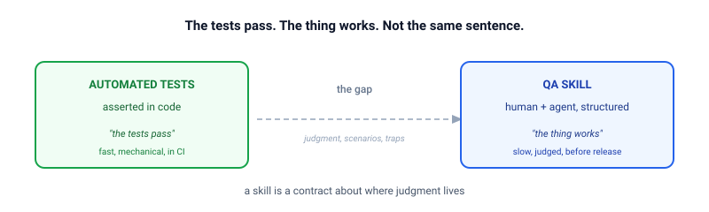
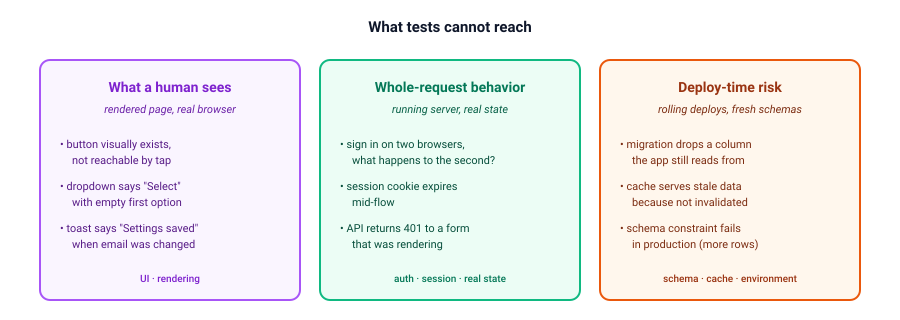
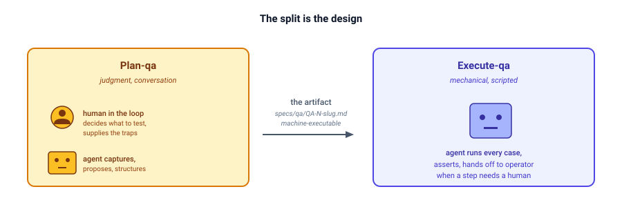
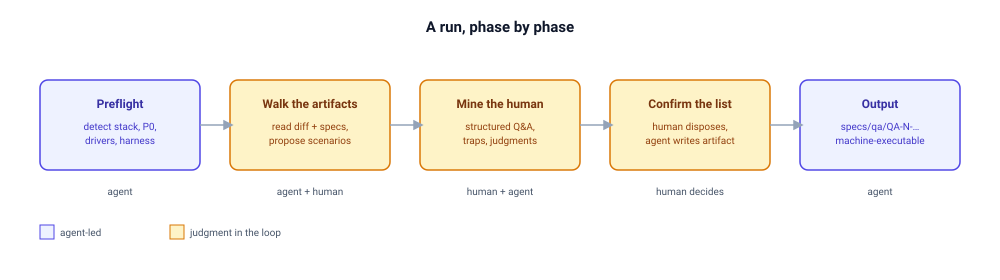
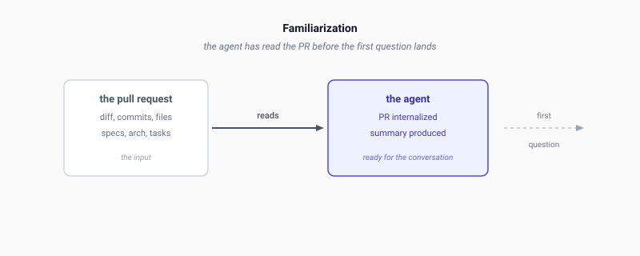
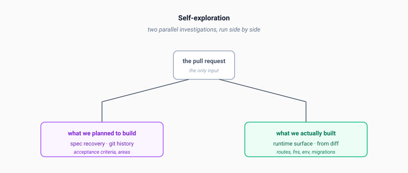
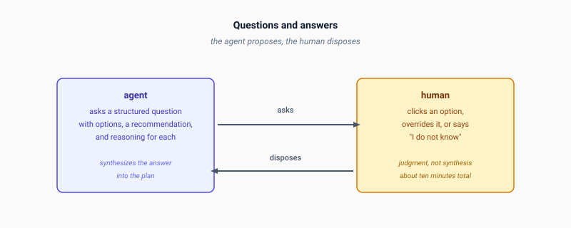
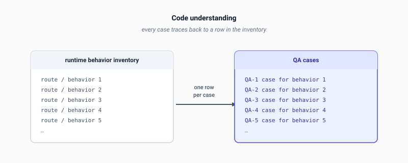

  Listen to this post
  <audio controls src="https://assets.foyzul.com/blog/audio/blog-draft-v2-narration.opus">
    Your browser does not support the audio element.
  </audio>

## Why a skill, not a prompt

This post is in three parts. Why a skill is needed. How it is shaped. What a run looks like in general. Any reader can map their own work onto the principles; the specifics in the demo at the end are not the point.

### The gap

When AI accelerates coding, it also widens a gap that already existed: the gap between "the tests pass" and "the thing actually works for a real human in a real session."

Tests verify what tests can assert. They check the parts of your system that have been written down as code. A green test suite tells you: this code, exercised the way the tests wrote it, produces the result the tests expected.

It does not tell you whether the button is unclickable on iPad Safari. Whether the redirect after login actually sends the user where they expect. Whether the migration runs cleanly against a fresh database, in the order it needs to run, before the unique index is created.

These are real things. They ship bugs. They are not, however, things that automated tests naturally express.

In 2015 this gap was narrow because code moved slowly. A team could keep their mental model of "how the system behaves" current by reading every change. In 2026, with agents shipping changes at the rate humans used to send emails, the gap is wider than ever. The mental model drifts. The tests stay current, but the model of what the tests should be checking does not.

### The new bottleneck

The agentic shift has multiplied code production. An agent can produce in an afternoon what a team used to produce in a week. The bottleneck of verifying the work has not multiplied. It has not moved at all.

We can automate verification, of course. The automated suite runs on every change, in seconds. But the script is not the bottleneck. The bottleneck is the question the script is supposed to answer. What should we verify. Which paths through the change. Which edge cases. Which environment behaviors. Which user-visible properties. Deciding that list is the slow part. Writing the script that runs the check is the fast part.

This is true for the QA person, who used to own the test list. It is also true for the developer, who now needs to verify their own work before it ships. Both are looking at the same change, trying to answer the same question, with the same bottleneck: not enough time to think about every angle.

A team can throw automation at the problem. The automation does not slow down. The list of things to verify does not get shorter when more code lands. It gets longer. The QA person cannot keep up. The developer cannot keep up. The verification work that used to take a day now takes a week, and the week is not getting any bigger.

We need a new angle — a way to scrutinize and verify the change to code and to output that scales with the rate of production. Not by writing more scripts, but by extracting the knowledge of what to verify into a form the machine can execute, with the human supplying the judgment.

### The three things tests cannot reach

When we say "QA" here, we do not mean unit tests or the CI pipeline. We mean the things a human reviewer would catch if they had a week to click through everything.

There are roughly three categories.

**What a human sees.** A button that visually exists but cannot be reached by tap. A dropdown that says "Select" but its first option is empty. A confirmation toast that says "Settings saved" when the user changed their email address — technically correct, but confusing. These are properties of the rendered page, in a real browser, at a real size. They do not live in your test suite because your test suite does not render the page.

**Whole-request behavior.** What happens when a user signs in on two browsers. What happens when a session cookie expires mid-flow. What happens when an API call returns 401 to a form that was rendering. These are properties of a running server, holding real state, with a real clock ticking. Tests stub these out, or they cover one of them, or they do not cover the interaction between them.

**Deploy-time risk.** The migration that drops a column the app still reads from during a rolling deploy. The cache that serves stale data because it was not invalidated. The schema constraint that fails in production because the test database had fewer rows. The test suite never exercises these because the test suite runs against a different environment than production.

A workflow that aims to cover these three things has to be shaped differently than a test suite. It has to put a human in the loop at the points where judgment is needed, and let a machine do the parts that are mechanical.

### Why this is a skill, not a prompt

The natural reaction is to ask the agent to "go QA this PR." The natural result is a plan that has whatever shape the agent decides, against whatever scope it decides, with whatever level of detail it decides. The agent would be doing the judgment and the execution. The developer would be reading the output.

This is the wrong split. The judgment is exactly what the developer should be doing. The mechanical work — clicking buttons, running shell commands, reading responses — is exactly what the agent is good at. A free-form ask collapses the two and assigns them to the wrong party.

A skill is a way of insisting on the split. The skill says: at this step, the human decides. At this step, the agent captures. At this step, the agent proposes and the human disposes. The judgment points are pre-named. The mechanical work is pre-shaped. The agent does not get to invent either one.

This is the central claim: **a skill is a contract about where judgment lives.**

## How the skill is designed

The skill in question is called plan-qa, and it works in two halves.

**Plan-qa** interviews the developer. It produces a plan.
**Execute-qa** runs the plan. It does not interview anyone.

The split is the design. The interview is where judgment happens: what to test, what to skip, what traps to look out for, what the human in the loop knows that the test suite does not. The execution is where the mechanical work happens: open the browser, click the button, assert the result. The human does not sit next to the agent for every click. They sit next to the agent for the questions, then walk away. The human in the loop is most often a developer, but the same workflow works for a QA person, a tech lead, or anyone with knowledge of the change.

### The artifact

The output of plan-qa is a single file: a QA plan, structured the same way every time.

The plan is not the goal. The conversation is the goal. The plan is a record of what was decided — good enough that an agent, given only the plan, can execute it without re-asking any questions. Every step is concrete. Every expected result is observable. The executing agent does not have to interpret; it executes. A QA team can hand the artifact to a CI bot, a developer can hand it to a junior engineer, and either can run the cases without going back to the planning conversation.

A plan has three properties worth naming.

**Coverage.** Every changed file in the diff appears in a coverage map, with at least one case that exercises it. A file with no natural case is flagged as a gap, not silently dropped. The reader of the plan can answer "did we test everything we changed?" by reading one table.

**Asserted vs. judged.** Every expected result is one of two things. An **assertion** is a machine-checkable fact — the button is clickable, the response code is 200, the database has two rows. A **judgment** is a qualitative property, with the pass/fail criterion fixed at plan time. Not "looks right." A specific sentence: pass if it names email notifications specifically, fail if it is a generic "Settings saved." The executing agent does not get to make judgment calls. If the criterion is "looks right," the agent cannot tell. If the criterion is specific, the agent can.

**Traps on the step they protect.** A trap is something the developer knows about — "this URL expires in 30 seconds," "this rate limit can be exhausted by a prior case," "this route 404s if the ID is guessed before the authorization check fires." The skill writes the trap onto the specific step it protects, not as a footnote list at the top. The executing agent reads the step, reads the trap, and applies both. A list-at-the-top is a list the agent forgets.

### Operator handoffs

Some steps a machine cannot do. Entering payment details into a third-party form. Approving an email on a real inbox. A hardware step. Verifying that a test account was seeded correctly, or that a stubbed service returned the right canned response. Each one is named, with the exact action written out, and the operator handoff is always the final step of the case. At run time, the executing agent stops, prints the instruction verbatim, and waits for the human to reply.

This is a load-bearing design choice. If the handoff could happen mid-case, the agent would learn to defer to the human on judgment ("you click it, you check the result"). The handoff is at the end so the agent learns that the human steps in only when the agent genuinely cannot.

### What the skill does not bake in

The skill ships no project-specific traps, helpers, identities, or commands. Every one of those is detected from the project, or elicited from the human in the loop during the conversation. This matters because a skill that bakes in last project's quirks will be wrong for next project's quirks. The discipline is: the skill is the shape. The conversation fills the shape with the human's knowledge of this project.

## What a run looks like

A run of plan-qa has a shape. The shape is general. The contents are project-specific. Knowing the shape means a human can predict what is coming and budget their attention.

### Preflight

Before the conversation starts, the skill reads the repository. It detects the default branch, the manifest, the test command, the browser capability, the shell tools that reach the running server. It decides two things: the **P0** — the automated suite that must be green before any run begins — and the **drivers** — browser, shell, or both. If P0 is red, the run does not start. The skill assumes tests exist and builds on top of them.

### Walk the artifacts

The agent reads the diff. If the project has REQ, ARCH, and TASKS documents, the agent reads those too. If not, the agent works from the diff alone, with a thinner but still useful plan. Either way, from the available evidence, the agent produces a list of candidate scenarios — one per user-facing flow or risk area — each traced back to a source. The list is short. The list is a proposal, not a decision.

The human reads the list. Adds what is missing. Removes what is not worth a case. The walk is the first judgment point.

### Mine the human in the loop

This is where the plan earns its value. The skill asks the human in the loop to walk through, in order, the click path they would take to convince themselves the change works. That walk becomes the happy-path cases.

Then the skill asks the harder questions. Where could this break in a way the test suite would not catch. What are the rendering quirks, the auth timing, the gate ordering, the data formats, the rate limits, the caches. Each answer becomes a trap on the specific step it protects. Each test account becomes an identity with a name. Each qualitative expectation becomes a judgment criterion written in the plan. If the human does not know an answer, the agent flags it as a gap, leaves the trap unset, and moves on. The case is still in the plan; the executing agent treats the gap as a known unknown rather than a silent omission.

The skill asks structured multiple-choice questions, with a recommendation and reasoning attached to each option. The human is not writing a test plan. The human is clicking through. The synthesis is the agent's job; the deciding is the human's.

### Confirm the list

The agent presents the final scenario list — case IDs, drivers, operator handoffs, guards, the completed coverage map. The human confirms, modifies, adds, or removes. The skill does not write the artifact until the human explicitly confirms.

### Output

The artifact is written to `specs/qa/QA-<N>-<slug>.md`. The same naming contract as REQ, ARCH, and TASKS. It lives in the same commit as the code it tests, or in a commit immediately after, so the plan and the change are reviewed together. It merges with the branch. After the PR merges, it is retired to the wiki. Like a test file, it is a first-class artifact of the change.

## Demo: one real run

To make the shape concrete, here is one real run — anonymized to the level of "one all-access subscription change in a learning platform, around 75 files." The reader can map their own work onto it; the specifics are not the point.

The four steps above — Familiarization, Self-exploration, Q&A, Code understanding — match the four phases of a run. Each screenshot shows what the agent has produced before the next step starts. The plan that comes out has cases the developer could not have written alone, because the agent captured the running surface and the developer supplied the judgment.

### The moment the skill earns its keep

About five minutes into this particular run, the agent did something wrong. It tried to plan against just the delta — the changes since the last plan — instead of the full diff. The developer had asked for full coverage earlier, and the agent forgot. It also started writing implementation steps that did not belong in a planning skill at all.

Two errors at once: scope drift, and responsibility drift. The agent did the wrong thing, and the wrong kind of thing.

The developer caught it. The agent stopped. Acknowledged the scope error. Acknowledged the responsibility error. Re-ran the right way.

This is what the skill makes possible. Without the skill, asking an AI agent to "go QA this PR" would produce a plan in whatever shape the agent decides, with whatever scope, with whatever level of detail. The agent would be doing the judgment and the execution. The developer would be reading the output.

With the skill, the developer is in the loop at every judgment point. The agent proposes structure. The developer disposes. The agent tries to drift; the developer catches it. The wrong-attempt moment is where the value becomes concrete. Without it, the skill is just a more elaborate prompt.

### The cost of a run

This particular run took five minutes of human time and 125,000 tokens of model time. The five minutes were spent entirely on judgment: approving the scenario list, answering the trap questions, fixing the wrong-attempt moment, confirming the final coverage. The 125,000 tokens were spent on synthesis: walking the diff, enumerating the running surface, drafting the cases, writing the artifact. By the time the human said "go," the agent already knew what to test, why, and what the traps were.

Five minutes is not nothing. But the alternative is: a developer reads the change, identifies the risk areas, lists the test cases, debates the scope with another developer, writes up the plan, hands it off. That workflow takes a half-day, and the result is usually less complete because the developer doing it is also shipping features.

125,000 tokens is also not nothing. At the rate this particular run consumed — 77% of a five-hour usage window — running the skill costs about a day's worth of capacity. For a routine change, that is hard to justify. For a change that touches payment flows or authentication or migration ordering, it is cheap.

The right framing is: this is planning, and planning has a cost. The cost is front-loaded and bounded. The alternative — discovering the bug in production — is unbounded.

## What you get

A QA plan in the shape described above. For the run above, the plan had 34 cases across 8 areas. Areas were named things like "Member payment history," "Admin payment history," "Trial lifecycle," "Content gating," "Stripe integration." The reader could answer "what does this PR do, and what are we checking?" by reading the plan front to back.

Plans are versioned like code. When the change moves, the plan moves with it. Superseded plans are retired, not left to drift. The `specs/qa/` directory holds one source of truth at a time.

## What this is not

This workflow is not a replacement for automated tests. The skill explicitly checks the automated suite as a precondition. If the suite is red, the run does not begin. The skill assumes tests exist and builds on top of them.

This workflow is not for every change. A documentation fix, a rename, a small UI tweak — these do not need a QA plan. The skill has a clear skip criterion: if the change has no running surface worth driving, do not bother.

This workflow is not autonomous. The human is in the loop at every judgment point. The agent does the synthesis, the structuring, the running. The human does the deciding. If you want a workflow where the agent decides, this is not it.

This workflow is also not novel. The basic idea — interview a developer, structure their knowledge into a checklist, hand it to someone else to execute — has been around for decades. What the AI era adds is that the "someone else" can drive a browser, run shell commands, and produce structured output. The interview is still a human conversation. The execution is faster, not different in kind.

## Closing

The tests pass. The thing works. These are not the same sentence.

In the AI era, the second sentence gets harder to verify as the first gets easier to achieve. The workflow above is one answer: a structured conversation that extracts the developer's knowledge, a structured artifact that captures the conversation, a structured execution that runs against the artifact.

The agent drives. The human judges.

If you want to try it, the skill is open source. It assumes a git repository, a way to invoke a Claude-style agent, and a human willing to spend ten minutes answering questions. Drop the skill into an agent harness that supports custom skills, point it at a pull request on a project that already has a green test suite, and let it run. The README walks through the rest.

The plan will be better than the agent could produce alone, because judgment is the part the agent cannot replace.

The plan will not be perfect. No plan is. But it will be a place to start, and that is the part that matters.

---

*Append: the four screenshots above are taken from a single session against a single pull request. The session audio narration and segmentation are available alongside the source.*
